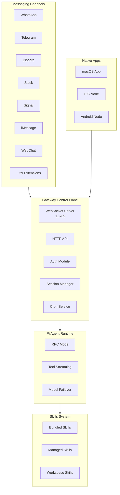

# Moltbot Architecture Analysis

> Analysis Summary: Moltbot is a mature personal AI assistant platform. Core designs worth learning from include the WebSocket Gateway control plane, multi-channel unified routing, plugin/skill system, and cross-platform native application architecture.

## Project Overview

| Attribute | Description |
|-----------|-------------|
| **Positioning** | Personal AI assistant, local-first execution |
| **Languages** | TypeScript (ESM), Swift, Kotlin |
| **Runtime** | Node.js 22+ |
| **Package Manager** | pnpm (monorepo) |
| **Build Tools** | tsc, rolldown, Vite |
| **Test Framework** | Vitest (70% coverage threshold) |
| **Code Standards** | oxlint, oxfmt |

---

## Core Architecture



---

## Noteworthy Designs

### 1. WebSocket Gateway Control Plane

**File**: `src/gateway/server.impl.ts`

The Gateway adopts a single WebSocket control plane design, unified management of:
- All client connections (CLI, Web UI, Native Apps)
- Channel routing and session isolation
- Tool calls and event broadcasting
- Health checks and status synchronization

```typescript
// Gateway Core Options
export type GatewayServerOptions = {
  bind?: "loopback" | "lan" | "tailnet" | "auto";
  controlUiEnabled?: boolean;
  openAiChatCompletionsEnabled?: boolean;  // OpenAI compatible API
  openResponsesEnabled?: boolean;           // OpenResponses API
  auth?: GatewayAuthConfig;
  tailscale?: GatewayTailscaleConfig;
};
```

> [!TIP]
> **Takeaway**: The cowork module in A-keep-up could adopt a similar WebSocket control plane pattern to unifiedly manage sandbox sessions and tool calls.

---

### 2. Multi-channel Unified Routing

**Directory**: `src/channels/`, `extensions/`

Supports 29+ messaging channels, unified access through a pluggable architecture:

| Core Channels | Extension Channels |
|---------------|--------------------|
| WhatsApp (Baileys) | Microsoft Teams |
| Telegram (grammY) | Matrix |
| Discord (discord.js) | BlueBubbles |
| Slack (Bolt) | Google Chat |
| Signal (signal-cli) | Zalo |
| iMessage (imsg) | Nostr, Twitch, etc. |

Each channel implements a unified interface:
- `gatewayMethods`: Channel-specific WS methods
- `allowFrom/dmPolicy`: DM access control
- `groups`: Group routing configuration

---

### 3. Skills System

**Directory**: `skills/` (53 skills)

Layered design for the skills system:

```
skills/
├── bundled/         # Built-in skills
├── managed/         # Platform-managed skills
└── workspace/       # User workspace skills (~/clawd/skills/)
```

Each skill includes:
- `SKILL.md`: Skill description and instructions
- Tool definitions and implementation
- Dependency declarations

Example skills: 1password, apple-notes, github, notion, obsidian, slack, trello...

> [!IMPORTANT]
> **Takeaway**: A-keep-up's skills system can refer to this layered structure, supporting bundled + workspace skills.

---

### 4. Plugin/Extension Architecture

**Directory**: `extensions/`

Plugin isolation design:
- Independent `package.json`, does not pollute main package dependencies
- Dynamic loading via jiti
- plugin-sdk provides a unified interface

```yaml
# pnpm-workspace.yaml
packages:
  - .
  - ui
  - packages/*
  - extensions/*  # Plugins as independent workspace packages
```

---

### 5. Native App Integration

**Directory**: `apps/`

Cross-platform native applications:

| Platform | Tech Stack | Features |
|----------|------------|----------|
| macOS | Swift/SwiftUI | Menu bar control, Voice Wake, Talk Mode |
| iOS | Swift/SwiftUI | Canvas, Camera, Screen Recording |
| Android | Kotlin | Canvas, Camera, Screen Recording |

Running in Node mode, exposing device capabilities to the Gateway:
- `system.run`: Local command execution
- `camera.snap/clip`: Photo/video capture
- `screen.record`: Screen recording
- `location.get`: Location retrieval

---

### 6. Pi Agent Runtime

**Dependencies**: `@mariozechner/pi-agent-core`, `@mariozechner/pi-ai`

Agent runtime features:
- Runs in RPC mode
- Tool Streaming and Block Streaming
- Model Failover
- Session persistence (`~/.clawdbot/sessions/`)

---

### 7. Security Model

Layered security design:

```
┌─────────────────────────────────────────┐
│ Main Session: Full host access          │
├─────────────────────────────────────────┤
│ Non-Main Sessions: Docker sandbox       │
│ - allowlist: bash, read, write, edit    │
│ - denylist: browser, canvas, nodes      │
└─────────────────────────────────────────┘
```

DM Pairing mechanism: Unknown senders require pairing code verification.

---

## Infrastructure

### Docker Deployment

```yaml
services:
  moltbot-gateway:
    image: moltbot:local
    ports:
      - "18789:18789"  # Gateway
      - "18790:18790"  # Bridge
    volumes:
      - ~/.clawdbot:/home/node/.clawdbot
      - ~/clawd:/home/node/clawd
```

### Network Exposure

- **Tailscale Serve/Funnel**: Secure remote access
- **TLS Support**: Self-signed certificates
- **Bonjour/mDNS**: LAN discovery

### Testing Strategy

```bash
pnpm test           # Unit tests (Vitest)
pnpm test:e2e       # E2E tests
pnpm test:live      # Real API tests
pnpm test:docker:*  # Docker environment tests
```

---

## Value for A-keep-up

| Domain | Moltbot Solution | A-keep-up Takeaway |
|--------|------------------|--------------------|
| **Control Plane** | WebSocket Gateway | Cowork could use a similar architecture for sandbox management |
| **Plugin System** | extensions/ + plugin-sdk | Existing similar structure, can enhance lifecycle management |
| **Skills System** | Layered skills (bundled/managed/workspace) | Unified skill format, support for remote discovery |
| **Native Apps** | Swift/Kotlin apps as Nodes | desktop-tauri can expose device capabilities |
| **Security Model** | Main/Non-Main session isolation | Reference for sandbox strategies |
| **Test Coverage** | 70% threshold + Docker E2E | Worth benchmarking against |

---

## Key File References

| File | Purpose |
|------|---------|
| `src/gateway/server.impl.ts` | Gateway main entry point |
| `src/channels/plugins/` | Channel plugin registration |
| `src/agents/` | Agent configuration and execution |
| `AGENTS.md` | Development standards and guidelines |
| `extensions/*/` | Channel extension implementations |
| `skills/*/SKILL.md` | Skill definitions |
