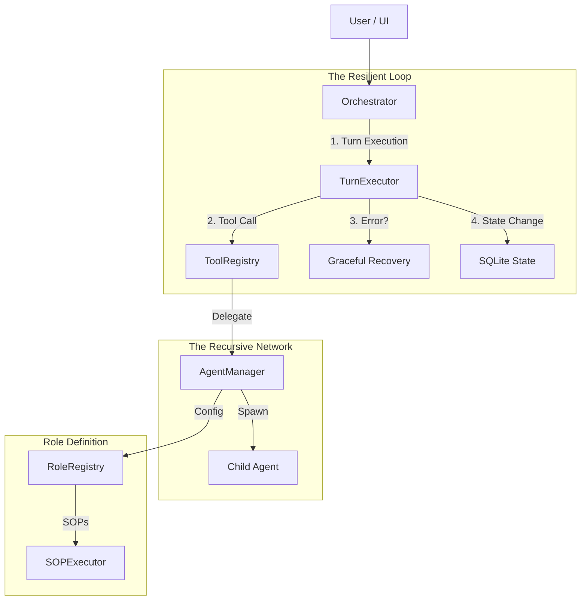

# [SUPERSEDED] Antigravity Team Report: Next-Gen Agent Architecture Analysis

> **NOTE:** This document is now historical. The authoritative specification is at `docs/specs/agent-runtime-spec-2026.md`.

# Antigravity Team Report: Next-Gen Agent Architecture Analysis

**Date**: January 18, 2026
**Author**: Antigravity Team (Google DeepMind)
**Subject**: Architectural Deep Dive & "Unified" Agent Vision
**Status**: Final Recommendations

---

## 1. Executive Summary

This report outlines the **Antigravity Team's** technical vision for the next generation of the `keep-up` agent runtime.

After a rigorous **source-code level analysis** of the industry's top 6 open-source agent frameworks (OpenCode, Gemini CLI, AutoGen, MetaGPT, LangGraph, CrewAI), we have identified a convergence towards four critical architectural pillars.

**The "Unified" Architecture Proposal**:
1.  **Recursive Delegation**: Moving from a flat tool list to a tree of specialized sub-agents.
2.  **Graceful Recovery**: Implementing a "Final Warning" protocol to eliminate silent failures.
3.  **Graph-Based State**: Adopting a Checkpointer-backed State Machine for time-travel debugging.
4.  **Role SOPs**: Defining agents by their *processes* (SOPs), not just their prompts.

Implementation of these pillars will transform `keep-up` from a standard orchestrated loop into a **resilient, recursive, and observable multi-agent ecosystem**.

---

## 2. Research Methodology

| Framework | Core Insight | Key Source File Analyzed |
| :--- | :--- | :--- |
| **OpenCode** | **Agent-as-a-Tool** | `internal/llm/agent/agent-tool.go` |
| **Gemini CLI** | **Graceful Recovery** | `packages/core/src/agents/local-executor.ts` |
| **LangGraph** | **State Persistence** | `langgraph/pregel/main.py` |
| **MetaGPT** | **Role SOPs** | `metagpt/roles/role.py` |
| **AutoGen** | **Actor Model** | `autogen_core/_single_threaded_agent_runtime.py` |
| **CrewAI** | **Hierarchical Process** | `src/crewai/crew.py` |

---

## 3. Deep Dive: The 4 Key Patterns

### Pillar A: Recursive Delegation (The "OpenCode" Pattern)
*Current Limitation*: `keep-up` uses a flat orchestrator where one agent sees all tools.
*Insight*: OpenCode allows an agent to call another agent as a tool (`AgentTool`). This encapsulates complexity.
*Recommendation*: Implement a `DelegateToAgent` tool.
```typescript
// Concept: Agent spawning child agent
const result = await agentManager.spawn({
  role: "researcher",
  task: "Find all usages of deprecated API X",
  parent: currentAgent.id
});
```

### Pillar B: Graceful Recovery (The "Gemini" Pattern)
*Current Limitation*: When `MAX_TURNS` is reached, the agent halts, often discarding valuable intermediate work.
*Insight*: Gemini CLI implements a "Final Warning" state. The system injects a message: *"You have 2 turns left. Stop and summarize."*
*Recommendation*: Inject a System Warning when `turns >= limit - 2`.

### Pillar C: Graph-Based State (The "LangGraph" Pattern)
*Current Limitation*: State is ephemeral memory. A crash loses the conversation.
*Insight*: LangGraph persists the state *after every transition* (Checkpointer). This enables "Time Travel" (resuming from any past step).
*Recommendation*: Implement an `SQLiteCheckpointer` that saves the `AgentState` after every tool execution.

### Pillar D: Role-Based SOPs (The "MetaGPT" Pattern)
*Current Limitation*: Roles are defined only by System Prompts ("You are a coder").
*Insight*: MetaGPT defines roles by **Standard Operating Procedures** (SOPs). A "Coder" isn't just a prompt; it's a class with a `Write -> Test -> Refactor` loop.
*Recommendation*: Define `RoleDefinition` objects that include explicit phase transitions (SOPs).

---

## 4. The Unified Technical Architecture

We propose refactoring `packages/agent-runtime` into the following layered architecture:



---

## 5. Implementation Roadmap

### Phase 1: Robustness (Immediate)
**Goal**: Stop agents from dying silently.
*   [ ] **Refactor**: `Orchestrator` loop to support interrupt signals.
*   [ ] **Feature**: `GracefulRecoveryEngine` (Inject warning at turn limit).
*   [ ] **Feature**: `DelegateToAgent` tool (Recursive dispatch).

### Phase 2: Persistence (Next Sprint)
**Goal**: Never lose context.
*   [ ] **Feature**: `SQLiteCheckpointer` implementation.
*   [ ] **Refactor**: Update `AgentState` to be serializable.
*   [ ] **Feature**: `SessionRecovery` (Resume crashed sessions).

### Phase 3: Specialization (Future)
**Goal**: Expert behavior.
*   [ ] **Feature**: `RoleRegistry` with SOP definitions.
*   [ ] **Feature**: `SOPExecutor` to enforce "Plan -> Act -> Verify" loops.

---

**Conclusion**: By adopting these patterns, `keep-up` will align with the state-of-the-art in 2026, offering users a reliable, debuggable, and vastly more capable agent experience.
