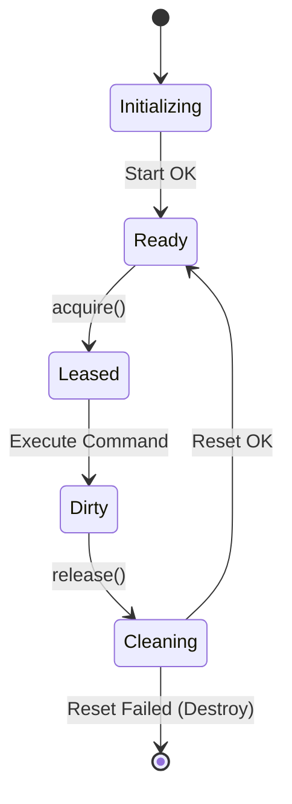

# Track J: Docker Container Pooling

Owner: Runtime Dev
Status: Completed
Date: 2026-01-19
Timeline: Week 2

## Objective
Reduce tool execution latency by eliminating container startup time from the critical path using a "warm pool" of Docker containers.

## Problem Analysis
- **Startup Latency**: `DockerSandboxManager.createSandbox` creates a new container on demand (~500ms - 3s). This latency is incurred on every new session or isolated run.
- **Resource Management**: No strict limit on concurrent container spawns, risk of resource exhaustion.

## Tasks

### Phase 1: Container Pool Implementation
- [x] Create `ContainerPool` class in `packages/agent-runtime/src/sandbox/containerPool.ts`.
- [x] Implement `acquire()`: Returns an immediately available container or waits.
- [x] Implement `release(container)`: Returns container to pool or marks for destruction.
- [x] Implement background replenishment loop to maintain `N` warm containers.

### Phase 2: Sandbox Manager Integration
- [x] Update `DockerSandboxManager` to use `ContainerPool`.
- [x] Implement "Reset/Clean" strategy for reused containers (e.g., `git clean -fdx`, `rm -rf /workspace/*`).
- [x] Add configuration for Pool Size (default: 2, max: 10).

### Phase 3: Lifecycle Management
- [x] Implement idle timeout (destroy warm containers if unused for X min).
- [x] Add health checks for pooled containers.

## Deliverables
- [x] `ContainerPool` class with unit tests.
- [x] Updated `DockerSandboxManager`.
- [x] Integration tests verifying pool behavior (reuse, replenishment).

## Technical Context

### State Machine
A pooled container transitions through the following states:


### Proposed Interface (`sandbox/containerPool.ts`)
```typescript
export interface ContainerPoolOptions {
  minSize: number;
  maxSize: number;
  image: string;
  idleTimeoutMs?: number;
}

export class ContainerPool {
  constructor(private docker: Dockerode, private options: ContainerPoolOptions) {}

  /** Get a ready container, creating one if necessary up to maxSize */
  async acquire(): Promise<Container>;

  /** Return container. If 'clean' is false, it will be reset or destroyed */
  async release(container: Container, clean: boolean): Promise<void>;
  
  /** Start background maintenance (replenish/cull) */
  start(): void;
  dispose(): void;
}
```

## Implementation Guide
- **Warmup**: `start()` should trigger `ensureMinSize()`.
- **Concurrency**: Use a mutex or queue for `acquire()` if pool is empty and `maxSize` reached.
- **Cleaning**: For `node:20-alpine`, a simple `rm -rf /workspace/*` via `exec` is usually sufficient for "Cleaning" state.

## Verification
- **Test**: `packages/agent-runtime/src/sandbox/__tests__/containerPool.test.ts`
- **Metric**: Measure `acquire()` latency. Should be <10ms for warm pool vs >500ms for cold.
