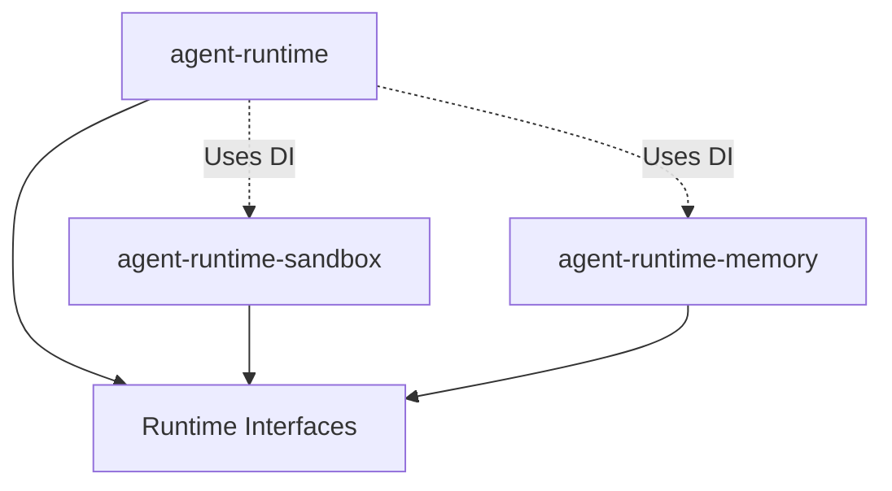

# Track L: Module Decomposition & Architecture

**Owner**: Runtime Architect
**Status**: Proposed
**Date**: 2026-01-19
**Timeline**: Week 4+

## Objective
Improve maintainability, testability, and velocity by decoupling specialized subsystems from the core Runtime/Orchestrator and moving towards a Strict Dependency Injection architecture.

## Problem Analysis
- **Monoliths**: `AgentRuntime` and `Orchestrator` are becoming "God Classes" managing too many concerns.
- **Coupling**: Hard dependencies make unit testing difficult (requiring complex mocks).
- **Extensibility**: Adding new "plugins" (like a new Sandbox provider) requires modifying core files.

## Tasks

### Phase 1: Architecture RFC
- [ ] Draft RFC for "Runtime vNext" architecture.
- [ ] Define interface boundaries for `SandboxManager`, `MemoryManager`, `ToolRegistry`.

### Phase 2: Package Extraction
- [ ] Identify code to move to `packages/agent-runtime-sandbox`.
- [ ] Identify code to move to `packages/agent-runtime-memory`.
- [ ] Setup new package scaffolding in monorepo.

### Phase 3: Dependency Injection
- [ ] Refactor `Orchestrator` to accept `IOrchestratorComponents` interface.
- [ ] Use a DI container or Factory pattern for wiring.

## Deliverables
- [ ] Architecture RFC.
- [ ] New packages (`sandbox`, `memory`).
- [ ] Refactored Core using DI.

## Technical Context

### Proposed Package Structure
```text
packages/
  agent-runtime/           (Core Orchestrator, Interfaces)
    package.json
    src/
      orchestrator/
      interfaces/          (IStorage, ISandbox, IMemory)
      
  agent-runtime-sandbox/   (Docker, Sandbox Logic)
    package.json
    src/
      docker/
      
  agent-runtime-memory/    (Memory Stores, Vector Logic)
    package.json
    src/
      stores/
```

### Dependency Graph (Target)

*Note: The Core Runtime should define the interfaces it needs. The implementations (Sandbox, Memory) depend on those interfaces, NOT the other way around (Dependency Inversion).*

## Refactoring Steps
1.  **Extract Interfaces**: Move `IMemoryStore`, `ISandbox` to `agent-runtime/src/core/interfaces.ts`.
2.  **Create Packages**: Initialize new `packages` with `pnpm init`.
3.  **Move Code**: Git mv files to preserve history.
4.  **Update Imports**: Fix all imports to use local workspace packages.

## Verification
- `pnpm build` passes for all packages.
- No cyclic dependencies (use `madge` to verify).

