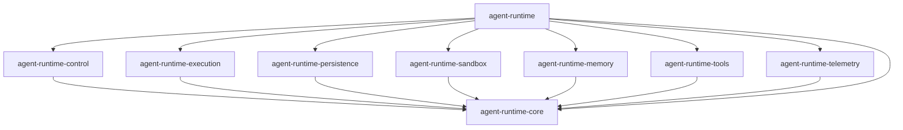

# Track L: Module Decomposition and Architecture

Owner: Runtime Architect
Status: Approved
Date: 2026-01-19
Timeline: Week 4+

## Objective
Improve maintainability, testability, and iteration speed by decomposing the runtime into strict modules with dependency inversion and an explicit composition root, without changing runtime behavior.

## Dependencies
- Track H (Optimization) complete.
- Agent Runtime Spec v2026.1, Section 4 (System Layers).
- `packages/agent-runtime/ARCHITECTURE.md` integration standards.

## Scope
- Define module boundaries aligned to control, execution, and persistence planes.
- Extract interface contracts into a core package used by implementations.
- Split implementation packages for sandbox, memory, tools, and telemetry.
- Introduce a strict DI wiring layer (factory/composition root).
- Preserve the `@ku0/agent-runtime` facade API.

## Non-Goals
- Implementing the decomposition in code for this track doc.
- Changing existing behavior, tool policies, or runtime contracts.
- Swapping mandated integrations (OpenAI Agents SDK, mem0ai, chokidar).

## Responsibilities
- Architect: module boundaries, dependency rules, RFC approval.
- Dev: package extraction plan, wiring strategy, compatibility shims.
- QA: verify build, dependency graph, and smoke tests after extraction.

## Key Deliverables
- Architecture RFC (module boundaries, dependency rules, migration plan): `docs/architecture/agent-runtime-module-decomposition-rfc.md`.
- Target package map and dependency graph.
- Composition root plan (`createRuntime` / `createOrchestrator` wiring).
- Compatibility plan for `@ku0/agent-runtime` re-exports.

## Target Package Map

| Plane | Package | Primary Modules | Notes |
| --- | --- | --- | --- |
| Core | `agent-runtime-core` | interfaces, types, contracts, shared utils | Dependency root |
| Control | `agent-runtime-control` | agent-manager, policy, recovery, message-bus | Depends on core |
| Execution | `agent-runtime-execution` | orchestrator, turn-executor, tool-scheduler, sop, routing | Depends on core |
| Persistence | `agent-runtime-persistence` | checkpoint, event-log, artifacts | Depends on core |
| Integrations | `agent-runtime-sandbox` | docker, local sandbox | Depends on core |
| Integrations | `agent-runtime-memory` | mem0 adapters, caches | Depends on core |
| Tooling | `agent-runtime-tools` | tool registry, tool servers, policy adapters | Depends on core |
| Telemetry | `agent-runtime-telemetry` | logging, metrics, tracing | Depends on core |
| Facade | `agent-runtime` | public API, composition root, re-exports | Depends on all |

## Dependency Rules
- `agent-runtime-core` has no dependencies on other runtime packages.
- Implementations depend on core interfaces, never on each other directly.
- Cross-plane calls go through interfaces in core or via the facade.
- The facade is the only package allowed to wire concrete implementations.

## Proposed Package Layout
```text
packages/
  agent-runtime-core/          (interfaces, contracts, shared types)
  agent-runtime-control/       (agent manager, policy, recovery, bus)
  agent-runtime-execution/     (orchestrator, turn executor, routing)
  agent-runtime-persistence/   (checkpoint, event log, artifacts)
  agent-runtime-sandbox/       (docker/local sandbox managers)
  agent-runtime-memory/        (mem0 adapter, cache layer)
  agent-runtime-tools/         (tool registry, tool servers)
  agent-runtime-telemetry/     (logging, metrics, tracing)
  agent-runtime/               (facade, composition root, re-exports)
```

## Dependency Graph (Target)


## Phased Plan

### Phase 1: Architecture RFC and Inventory
- [x] Inventory current modules and cross-dependencies.
- [x] Map each module to control, execution, or persistence planes.
- [x] Draft RFC with boundary rules and migration steps.
- [x] Resolve open placements for bridge/browser/cowork/events (see [Resolved Placements](../architecture/agent-runtime-module-decomposition-rfc.md#resolved-placements)).

### Phase 2: Core Interfaces and Composition Root
- [x] Extract runtime interfaces and shared types into `agent-runtime-core`.
- [x] Define `RuntimeComponents` wiring contract.
- [x] Design `createRuntime` composition factory for explicit DI.
- [x] Break circular dependencies per RFC Cycle Resolution Plan.

### Phase 3: Package Extraction
- [x] Extract telemetry/logging into `agent-runtime-telemetry`.
- [x] Extract memory into `agent-runtime-memory`.
- [ ] Create package scaffolding and move plane modules.
- [ ] Move integrations into sandbox and memory packages.
- [ ] Move tool registry and servers into tooling package.

### Phase 4: Wiring and Compatibility
- [ ] Update facade exports to preserve `@ku0/agent-runtime` API.
- [ ] Add dependency checks (madge or dependency-cruiser).
- [ ] Update documentation and migration notes.

## Acceptance Criteria
- No cyclic dependencies across runtime packages.
- Facade package exports remain API-compatible.
- Build passes for all runtime packages.
- Dependency rules enforced by tooling.

## Required Tests
- `pnpm build` for the workspace.
- Targeted runtime unit tests after extraction.
- Smoke tests for orchestrator startup and tool registry wiring.

## Risks and Mitigations
- **Dependency drift**: enforce rules with automated checks in CI.
- **Compatibility breaks**: keep facade re-exports and add shims where needed.
- **Migration scope creep**: use RFC to lock boundaries before refactors.
