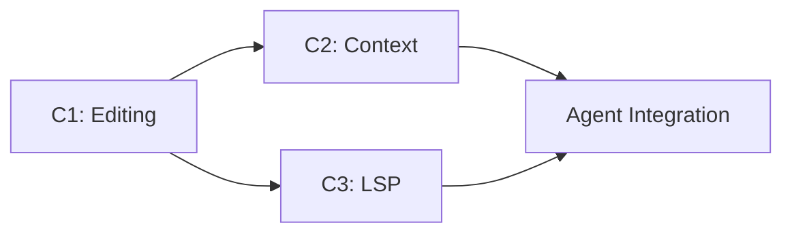

# Code Agent Capability Roadmap

**Overview**: This roadmap defines the parallel development tracks for building a top-tier AI Code Agent. All designs are derived from deep analysis of production-grade implementations in `.tmp/analysis/`.

---

## Source Analysis Summary

| Project | Language | Key Insights Extracted |
|---------|----------|------------------------|
| `opencode` | Go | LSP client architecture, fuzzy patch application, JSON-RPC transport |
| `MetaGPT/SWE-agent` | Python/Shell | Lint-driven edit rollback, windowed file viewing, shell-based navigation |
| `gemini-cli` | TypeScript | Web search grounding, tool definitions, streaming |
| `crewAI` | Python | Tavily/Serper integration patterns, domain filtering |

---

## Parallel Tracks

| Track | Name | Priority | Status | Branch |
|-------|------|----------|--------|--------|
| **C1** | [Editing Primitives](./track-c1-editing-primitives.md) | High | ✅ Completed | `main` |
| **C2** | [Context Management](./track-c2-context-management.md) | High | ✅ Completed | `main` |
| **C3** | [LSP Integration](./track-c3-lsp-integration.md) | Medium | ✅ Completed | `main` |

---

## Best Practices Applied

### From `opencode` (Go)
1. **Fuzzy Patch Matching** (C1): Tolerate minor whitespace differences when applying diffs.
   - Source: `opencode/internal/diff/patch.go` → `findContextCore()` with 3-pass matching.
2. **LSP Client Lifecycle** (C3): Proper initialization sequence with warm-up polling.
   - Source: `opencode/internal/lsp/client.go` → `WaitForServerReady()`.
3. **Language Server Detection** (C3): Auto-detect project type from marker files.
   - Source: `opencode/internal/lsp/client.go` → `detectServerType()`.

### From `SWE-Agent` (Shell)
1. **Lint-Driven Rollback** (C1): Run linter after edit; revert on new errors.
   - Source: `MetaGPT/metagpt/tools/swe_agent_commands/edit_linting.sh`.
2. **Windowed Viewing** (C2): Scroll through files like a human in an IDE.
   - Source: `defaults.sh` → `_print()`, `scroll_up()`, `scroll_down()`, `goto()`.
3. **Shell Command Pattern** (C2): Simple, composable commands for navigation.

### From `crewAI/Tavily` (Python)
1. **Provider Abstraction** (Web Search): Interface-based design for swappable backends.
   - Source: `crewai_tools/tools/tavily_search_tool/tavily_search_tool.py`.
2. **Content Truncation**: Limit result content to avoid context explosion.

---

## Implementation Order Recommendation



1. **Start with C1** (Editing Primitives): Foundation for all file manipulation.
2. **Parallel: C2 + C3**: Context management and LSP can be developed independently.
3. **Integration**: Wire all tools into the Agent Runtime's tool registry.

---

## Getting Started

```bash
# Create feature branch for Track C1
git checkout -b feat/code-editing-primitives

# Create the code tools directory
mkdir -p packages/agent-runtime/src/tools/code

# Start implementing fileSystem.ts, editor.ts, etc.
```

---

## Definition of Done (All Tracks)

- [ ] All interfaces implemented as specified
- [ ] Unit tests with >80% coverage
- [ ] Integration tests pass
- [ ] `pnpm typecheck` passes
- [ ] `pnpm lint` passes
- [ ] PR created and reviewed
