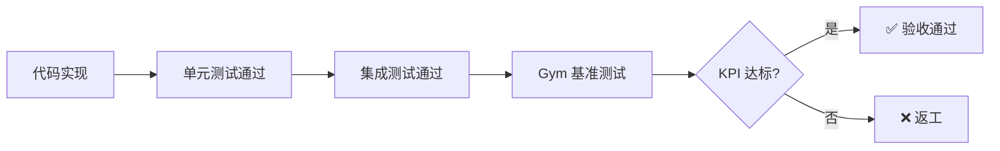

# Q3 验收标准 (Acceptance Criteria)

> **目的**: 防止"理想化"规划，确保每个 Track 交付可量化、可验证的实际价值。
> **原则**: 每项标准必须是 **可测试的**，拒绝主观描述。

---

## 验收流程

---

## Track X: Deep Code Perception

### 必须通过的测试用例

| ID | 场景 | 输入 | 预期输出 | 验收命令 |
|----|------|------|----------|----------|
| X-AC-1 | 符号定位 | "找到 AuthService 类" | 返回正确文件路径和行号 | `pnpm test:x1` |
| X-AC-2 | 引用查找 | "findReferences('login')" | 返回 >=3 个调用位置 | `pnpm test:x2` |
| X-AC-3 | 安全重命名 | "rename UserService -> AccountService" | 所有 import 语句自动更新，0 编译错误 | `pnpm test:x3` |
| X-AC-4 | 影响分析 | "编辑 utils/auth.ts" | 返回受影响文件列表 | `pnpm test:x4` |

### 量化 KPI

| 指标 | 基准值 | 目标值 | 测量方法 |
|------|--------|--------|----------|
| 符号解析成功率 | N/A | >95% | `agent-gym` 符号定位测试集 |
| 幻觉率 (发明不存在的方法) | N/A | <1% | `agent-gym` 代码生成验证 |
| LSP 响应延迟 | N/A | <100ms | P95 延迟监控 |

### 交付物检查清单

- [ ] `packages/agent-runtime/src/lsp/` 目录存在且包含 `LSPService.ts`
- [ ] `SymbolGraph` 类导出并有完整类型定义
- [ ] `nav_def`, `nav_refs`, `rename_sym` 工具注册到 MCP
- [ ] 10+ 单元测试覆盖核心逻辑

---

## Track Y: Adaptive Learning

### 必须通过的测试用例

| ID | 场景 | 输入 | 预期输出 | 验收命令 |
|----|------|------|----------|----------|
| Y-AC-1 | 偏好学习 | 用户说 "不要用 var" | 规则被持久化到 LessonStore | `pnpm test:y1` |
| Y-AC-2 | 跨会话记忆 | 新会话，Agent 生成代码 | 代码不包含 `var` | `pnpm test:y2` |
| Y-AC-3 | 规则删除 | 用户删除规则 | 下次生成代码可包含 `var` | `pnpm test:y3` |
| Y-AC-4 | 噪音过滤 | 无关任务 | 不应用无关规则 | `pnpm test:y4` |

### 量化 KPI

| 指标 | 基准值 | 目标值 | 测量方法 |
|------|--------|--------|----------|
| 召回准确率 (Precision@1) | N/A | >90% | `agent-gym` 记忆检索测试 |
| 规则遵守率 | N/A | 100% | 10 个偏好测试用例 |
| 检索延迟 | N/A | <50ms | 1000 条规则下的 P95 |

### 交付物检查清单

- [ ] `packages/agent-runtime-memory/src/lessons/` 目录存在
- [ ] `Lesson` 类型定义包含 `trigger`, `rule`, `confidence`
- [ ] 支持 SQLite VSS 或 LanceDB 向量存储
- [ ] Cowork App 中可查看/删除已学习规则

---

## Track Z: Agent Gym

### 必须通过的测试用例

| ID | 场景 | 输入 | 预期输出 | 验收命令 |
|----|------|------|----------|----------|
| Z-AC-1 | Harness 启动 | 空项目 | Agent Runtime 正常初始化 | `pnpm test:z1` |
| Z-AC-2 | 评分引擎 | 语法错误代码 | 返回 `{pass: false, reason: "syntax"}` | `pnpm test:z2` |
| Z-AC-3 | CI 集成 | PR 提交 | GitHub Action 运行并报告 IQ | `gh workflow run gym` |
| Z-AC-4 | 回归检测 | 降低模型能力 | CI 失败并阻止合并 | 手动验证 |

### 量化 KPI

| 指标 | 基准值 | 目标值 | 测量方法 |
|------|--------|--------|----------|
| Easy 测试集通过率 | N/A | >90% | 10 个简单任务 |
| Medium 测试集通过率 | N/A | >70% | 15 个中等任务 |
| 测试执行时间 | N/A | <5min | Easy 测试集完整运行 |

### 交付物检查清单

- [ ] `packages/agent-gym/` 独立包存在
- [ ] `benchmarks/` 包含 50+ 测试场景 YAML
- [ ] `.github/workflows/gym.yml` CI 配置
- [ ] IQ 分数可在 Cowork 开发者设置中查看

---

## 整体验收标准

> [!CAUTION]
> 以下任一条件不满足，Q3 **不得视为完成**：

1. **所有 AC 测试通过**: `pnpm test:q3` 返回 0 错误
2. **CI IQ Gate 正常工作**: 至少 1 个 PR 被 IQ 下降阻止
3. **无回归**: 现有 `agent-runtime` 测试 100% 通过
4. **文档更新**: 每个 Track 有对应的 WALKTHROUGH.md

---

## 验收时间表

| 里程碑 | 日期 | 验收内容 |
|--------|------|----------|
| M1 完成 | 2026-04-30 | Track X (X-AC-1, X-AC-2, X-AC-3) |
| M2 完成 | 2026-05-31 | Track X (X-AC-4) + Track Y (Y-AC-1, Y-AC-2) |
| M3 完成 | 2026-06-30 | Track Y (Y-AC-3, Y-AC-4) + Track Z 全部 |
| Q3 总验收 | 2026-07-07 | 整体验收标准全部通过 |
