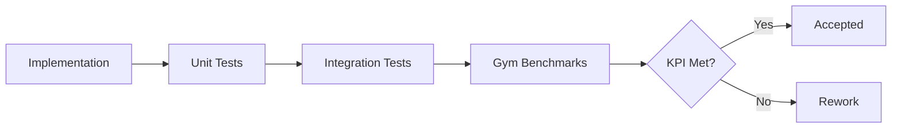

# Q4 Acceptance Criteria

Date: 2026-07-10
Owner: QA Engineer
Status: Ready
Dependencies: Q4 tracks AA/AB/AC, Q3 Gym baseline

Purpose: prevent aspirational planning by requiring measurable and testable
outcomes for each track.

Benchmark definitions live in `docs/roadmap/next-q4/benchmarks.md`.
Run validation commands from the repo root.

---

## Acceptance Flow

---

## Evidence Required

- Unit and integration test logs for each track.
- Gym benchmark report with KPI rollups.
- Audit trail samples for policy enforcement tests.
- Walkthrough steps recorded per track.
- CLI accepts Q4 categories in `packages/agent-gym/src/cli/run.ts`.

---

## Track AA: Elastic Execution and Scale

### Required Test Cases

| ID | Scenario | Input | Expected Output | Validation |
| --- | --- | --- | --- | --- |
| AA-AC-1 | Parallel throughput | 100 concurrent tasks | 0 lost tasks, ordered completion metadata | Gym suite: execution-scale |
| AA-AC-2 | Fast resume | Kill runtime mid-run | Resume within 1s from checkpoint | Gym suite: execution-scale |
| AA-AC-3 | Cancellation | Cancel active task | Tool calls stopped and state finalized | Runtime unit tests |
| AA-AC-4 | Backpressure | Over quota load | Scheduler throttles without crash | Gym suite: execution-scale |

### Validation Commands

- `pnpm --filter @ku0/agent-runtime test -- --grep "execution"`
- `pnpm --filter @ku0/agent-gym gym:run -- --suite easy --category execution-scale --benchmarks packages/agent-gym/benchmarks/q4 --report packages/agent-gym/reports/q4-execution-scale.json`

### KPIs

| Metric | Baseline | Target | Measurement |
| --- | --- | --- | --- |
| Scheduler latency (P95) | N/A | <50ms | load test in Gym |
| Resume latency (P95) | N/A | <1s | checkpoint replay suite |
| Task loss rate | N/A | 0% | stress test suite |

### Deliverable Checklist

- [ ] `packages/agent-runtime/src/execution/` contains scheduler and worker registry.
- [ ] Execution leases are persisted via `packages/agent-runtime-persistence/`.
- [ ] Backpressure and quota policies are enforced before tool execution.
- [ ] 10+ unit tests cover scheduling and cancellation.
- [ ] `packages/agent-runtime-core/src/index.ts` exposes `ExecutionLease` and `WorkerStatus`.

---

## Track AB: Visual Intelligence and Layout Graph

### Required Test Cases

| ID | Scenario | Input | Expected Output | Validation |
| --- | --- | --- | --- | --- |
| AB-AC-1 | Layout graph | Screenshot + DOM | LayoutGraph with node positions | Gym suite: visual-layout |
| AB-AC-2 | Visual diff | Before/after screenshots | Diff score and hotspots | Gym suite: visual-diff |
| AB-AC-3 | Screen to code | Click region | Code location mapping | Runtime integration tests |

### Validation Commands

- `pnpm --filter @ku0/agent-runtime-vision test -- --grep "layout"`
- `pnpm --filter @ku0/agent-gym gym:run -- --suite easy --category visual-layout --benchmarks packages/agent-gym/benchmarks/q4 --report packages/agent-gym/reports/q4-visual-layout.json`
- `pnpm --filter @ku0/agent-gym gym:run -- --suite easy --category visual-diff --benchmarks packages/agent-gym/benchmarks/q4 --report packages/agent-gym/reports/q4-visual-diff.json`

### KPIs

| Metric | Baseline | Target | Measurement |
| --- | --- | --- | --- |
| Region detection accuracy | N/A | >95% | UI benchmark set |
| Diff false positives | N/A | <1% | visual regression suite |
| Mapping latency (P95) | N/A | <200ms | profiling harness |

### Deliverable Checklist

- [ ] `packages/agent-runtime-vision/` provides LayoutGraph and diff utilities.
- [ ] `agent-runtime-tools` includes `layout_scan`, `visual_diff`, `map_region`.
- [ ] 10+ tests cover layout parsing and diff scoring.
- [ ] Artifact schemas are registered for `LayoutGraph` and `VisualDiffReport`.

---

## Track AC: Policy and Ops Governance

### Required Test Cases

| ID | Scenario | Input | Expected Output | Validation |
| --- | --- | --- | --- | --- |
| AC-AC-1 | Injection defense | Command with operators | Denied with policy reason | Gym suite: policy-safety |
| AC-AC-2 | Allow rule | Explicit allow pattern | Allowed and audited | Runtime unit tests |
| AC-AC-3 | Audit trail | Tool execution | Immutable audit record | Runtime integration tests |
| AC-AC-4 | Policy override | Admin exception | Scoped allow with expiry | Gym suite: policy-safety |

### Validation Commands

- `pnpm --filter @ku0/agent-runtime test -- --grep "policy"`
- `pnpm --filter @ku0/agent-gym gym:run -- --suite easy --category policy-safety --benchmarks packages/agent-gym/benchmarks/q4 --report packages/agent-gym/reports/q4-policy-safety.json`

### KPIs

| Metric | Baseline | Target | Measurement |
| --- | --- | --- | --- |
| Policy decision latency (P95) | N/A | <10ms | policy benchmark |
| Unsafe command escapes | N/A | 0% | security test suite |
| Audit completeness | N/A | 100% | audit replay |

### Deliverable Checklist

- [ ] `packages/agent-runtime/src/cowork/policy.ts` is extended with the Q4 policy DSL.
- [ ] `packages/agent-runtime/src/security/` includes the tool policy adapter.
- [ ] `packages/agent-runtime-telemetry/` stores audit records for tools.
- [ ] Cowork UI exposes policy rule management and audit logs.
- [ ] 10+ tests cover rule evaluation and audit integrity.
- [ ] Core tools declare `annotations.policyAction`.
- [ ] `MCPTool.annotations.policyAction` is defined in `packages/agent-runtime-core/src/index.ts`.
- [ ] Tool registry rejects tools without `annotations.policyAction`.

---

## Overall Acceptance

Q4 is not complete unless all conditions are met:

1. All track AC validations pass: `pnpm --filter @ku0/agent-gym gym:run -- --benchmarks packages/agent-gym/benchmarks/q4 --suite easy --report packages/agent-gym/reports/q4-easy.json` returns zero failures.
2. Gym benchmarks meet or exceed KPI targets.
3. No regression in Q2/Q3 runtime tests.
4. Documentation and walkthrough updates are complete.
5. Policy audit trail entries are present for every tool execution in tests.
6. Q4 Gym baselines are enforced in CI with an explicit min-score threshold.
7. Min-score thresholds match `docs/roadmap/next-q4/benchmarks.md`.
8. CI runs `pnpm --filter @ku0/agent-gym gym:q4:ci` with Q4 baselines.
