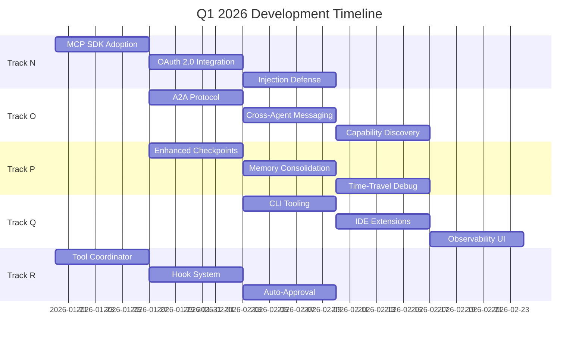

# Agent Runtime 2026 Q1 - Next Phase Parallel Development

> **Date**: 2026-01-21  
> **Status**: Active  
> **References**: `.tmp/analysis/` (10 projects), `docs/roadmap/phase-1-foundation/arch/`, `docs/roadmap/progress/progress-2026-01-21.md`

See also: [docs/roadmap/README.md](/docs/roadmap/README.md)

---

## Executive Summary

Based on deep source-level analysis of production agent implementations (OpenCode, Cline, Roo-Code, AutoGPT, LangGraph, MetaGPT, CrewAI, open-interpreter), this folder defines **5 parallel development tracks** optimized for maximum velocity and technical excellence.

---

## Analysis Sources

| Project | Language | GitHub Stars | Key Insights |
|---------|----------|--------------|--------------|
| **OpenCode** | Go | 50K+ | Event-driven pubsub, LSP lifecycle, MCP integration |
| **Cline** | TypeScript | 50K+ | MCP Hub with OAuth/SSE, ToolExecutor coordinator, 26 handlers |
| **Roo-Code** | TypeScript | Active | Git-based checkpoints (shadow repo), diff view, 20 core modules |
| **LangGraph** | Python | 140K+ | Checkpoint backends (Postgres/SQLite), reducer-driven state |
| **AutoGPT** | Python | 177K | Agent JSON configs, Prisma schema (35KB), graph templates |
| **MetaGPT** | Python | - | Lint-driven rollback, SWE-agent patterns |
| **open-interpreter** | Python | - | async_core, respond pipeline, computer_use |

---

## Current Roadmap Status

| Track Group | Status | Notes |
|-------------|--------|-------|
| Track A-G | ✅ Completed | Core runtime contracts |
| Track H (Optimization) | ✅ Completed | Caching, routing, metrics |
| Track I-K (Performance) | ✅ Completed | LRU, Docker pooling, memory |
| Track L (Architecture) | ⚠️ In Progress | Execution plane + artifacts/checkpoint consolidation pending |
| Track M1-M5 | ✅ Completed | Implemented in monolith; re-home after L1/L2 |
| Track N/P/R | 🟡 Active | MCP security, state/memory, tool framework partial |
| Code Tracks C1-C3 | ✅ Completed | Editing, context, LSP |
| Track Q (DX) | 📋 Proposed | Not audited in this update |
| Track 16 (Phase G) | 📋 Proposed | Agentic capabilities |

---

## Next Phase: 5 Parallel Tracks



---

## Track Index

| Track | Focus | Priority | Document |
|-------|-------|----------|----------|
| **N** | MCP 2.0 & Security | 🔴 Critical | [track-n-mcp-security.md](./track-n-mcp-security.md) |
| **O** | Agent Collaboration | 🟡 High | [track-o-agent-collaboration.md](./track-o-agent-collaboration.md) |
| **P** | State & Memory | 🟡 High | [track-p-state-memory.md](./track-p-state-memory.md) |
| **Q** | Developer Experience | 🟢 Medium | [track-q-developer-experience.md](./track-q-developer-experience.md) |
| **R** | Tool Framework | 🟡 High | [track-r-tool-framework.md](./track-r-tool-framework.md) |

---

## Best Practices Extracted

### From Cline (TypeScript)
1. **MCP Hub Architecture**: Centralized server management with OAuth, SSE/HTTP transports
2. **Tool Coordinator Pattern**: Handler registration, partial block streaming, validation
3. **Auto-Approval System**: Policy-based tool execution with user settings
4. **Hook System**: Pre/Post tool execution hooks for context modification

### From Roo-Code (TypeScript)
1. **Git-Based Checkpoints**: Shadow repository for workspace state
2. **Checkpoint Diff**: Compare states with `from-init`, `to-current`, `full` modes
3. **Message Manager**: Rewind to timestamp with context cleanup  
4. **Telemetry Integration**: Per-checkpoint metrics

### From LangGraph (Python)
1. **Checkpoint Backends**: Abstract interface with Postgres/SQLite implementations
2. **Thread Organization**: Checkpoint history per conversation thread
3. **Reducer-Driven State**: Explicit schema with type safety
4. **Prebuilt Components**: Reusable agent patterns

### From OpenCode (Go)
1. **Event-Driven Core**: Typed pubsub for orchestration
2. **Session Persistence**: SQLite-backed conversations
3. **Permission System**: Granular per-tool authorization
4. **Multi-Provider Support**: 75+ LLM providers

---

## Parallel Development Matrix

| Week | Track N | Track O | Track P | Track Q | Track R |
|------|---------|---------|---------|---------|---------|
| 1 | N1: MCP SDK | - | - | - | R1: Coordinator |
| 2 | N2: OAuth | O1: A2A | P1: Checkpoints | - | R2: Hooks |
| 3 | N3: Defense | O2: Messaging | P2: Memory | Q1: CLI | R3: Auto-Approve |
| 4 | - | O3: Discovery | P3: TimeTravel | Q2: IDE | - |
| 5 | - | - | - | Q3: Dashboard | - |

---

## Quick Start

```bash
# Clone reference projects for analysis
cd .tmp/analysis
git clone --depth 1 https://github.com/cline/cline.git
git clone --depth 1 https://github.com/RooVetGit/Roo-Code.git
git clone --depth 1 https://github.com/langchain-ai/langgraph.git

# Start development on Track N
git checkout -b feat/track-n-mcp-security
```

---

## Definition of Done (All Tracks)

- [ ] All interfaces implemented per specification
- [ ] Unit tests with >80% coverage
- [ ] Integration tests pass
- [ ] `pnpm typecheck` passes
- [ ] `pnpm lint` passes
- [ ] Documentation updated
- [ ] PR created and reviewed
