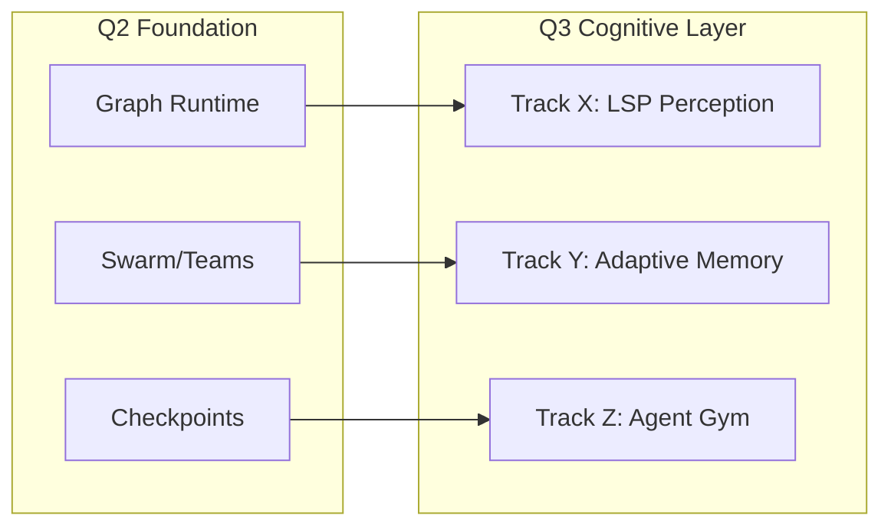
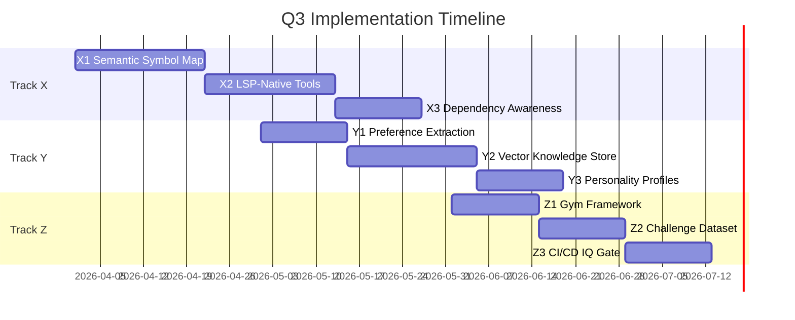

# Q3 Roadmap: The Cognitive Layer

> **Date**: 2026-01-20
> **Owner**: Keep-Up Engineering
> **Status**: Proposed
> **Completion Review**: Incomplete (docs-only audit)
> **Dependencies**: Q2 (Graph Runtime, Multi-Agent Teams, Time Travel)
> **Analysis**: [sota-gap-analysis.md](./sota-gap-analysis.md)

---

> [!NOTE]
> **Context**: This roadmap assumes the successful completion of **Q2 (The Graph Runtime Foundation)**, which delivered the Graph Engine, Multi-Agent Teams, and Time Travel.
> 
> **Theme**: Transitioning from "Smart Tool User" to "Adaptive Learner".

## Overview

With the Runtime (Q2) providing a robust body (Hands/Tools) and nervous system (Graph/Events), Q3 focuses on the **Mind**. We aim to give the agent "sight" (LSP), "memory" (Adaptive Learning), and "self-improvement" (Gym).

## Completion Audit (Docs Only)

This audit checks documentation readiness and repository script wiring only. It does not verify implementation or KPI baselines.

| Area | Status | Evidence |
| --- | --- | --- |
| Status labels | Incomplete | Roadmap and tracks remain Proposed with no completion evidence. |
| Acceptance criteria wiring | Partial | `test:q3` and per-track scripts exist; no execution evidence recorded. |
| Walkthrough coverage | Complete | Track walkthroughs exist and are linked. |
| Language consistency | Complete | Q3 docs are English-only. |
| Roadmap index | Complete | Q3 entries added to the roadmap index. |

## Completion Verdict

Q3 is not complete based on documentation and script wiring. To close:
- Run `pnpm test:q3` and attach results in this folder.
- If X/Y AC tests are missing, implement them and tag with AC IDs.
- Record KPI baselines in KeepUpGym and link the report here.
- Q3 Gym baselines:
  - `baselines/q3-perception-accuracy.json`
  - `baselines/q3-memory-recall.json`
  - `baselines/q3-plan-quality.json`

---

## Tracks

### Track X: Deep Code Perception (The "Eyes")
**Status**: `Proposed` | **Priority**: `Critical` | **Timeline**: Month 1-2

Upgrade the agent's perception from "Text-based" (grep/cat) to **"LSP-Native"** (AST/Symbols).

- **Objective**: The agent should "see" the code structure (Classes, References, Types) instantly, without needing to `grep`.
- **Key Deliverable**: `CodeKnowledgeGraph` — A real-time graph of symbols and dependencies in the workspace.
- **Details**: [track-x-deep-code-perception.md](./track-x-deep-code-perception.md)

### Track Y: Adaptive Learning (The "Hippocampus")
**Status**: `Proposed` | **Priority**: `High` | **Timeline**: Month 2-3

Enable the agent to "learn" from user corrections and past mistakes for the long term.

- **Objective**: If a user says "Don't use `var`", the agent should *never* do it again, across any session.
- **Key Deliverable**: `SemanticMemoryStore` — A vector-backed strict rule and preference engine.
- **Details**: [track-y-adaptive-learning.md](./track-y-adaptive-learning.md)

### Track Z: Agent Gym (Quality Assurance & Metrics)
**Status**: `Proposed` | **Priority**: `High` | **Timeline**: Month 3

Automated regression testing and **KPI tracking** for the agent's cognitive capabilities.

- **Objective**: Prevent "Lobotomies" and prove "SOTA" status with hard numbers.
- **Key Deliverable**: `KeepUpGym` — A suite of benchmarks measuring Perception Accuracy, Memory Recall, and Planning Efficiency.
- **Details**: [track-z-agent-gym.md](./track-z-agent-gym.md)

---

## Track Index

| Track | Focus | Priority | Timeline | Document |
| --- | --- | --- | --- | --- |
| X | Deep Code Perception (LSP) | Critical | Month 1-2 | [track-x](./track-x-deep-code-perception.md) |
| Y | Adaptive Learning | High | Month 2-3 | [track-y](./track-y-adaptive-learning.md) |
| Z | Agent Gym (Evals) | High | Month 3 | [track-z](./track-z-agent-gym.md) |
| **AC** | **Acceptance Criteria** | **Critical** | - | [**acceptance-criteria.md**](./acceptance-criteria.md) |

---

## Timeline (3 Months)

**Month 1 (April)**
- X1: Semantic Symbol Map
- X2: LSP-Native Tools (`nav_def`, `nav_refs`)

**Month 2 (May)**
- X3: Dependency Awareness (Impact Analysis)
- Y1: Preference Extraction ("Critic" Agent)
- Y2: Vector-Backed Knowledge Store

**Month 3 (June)**
- Y3: Personality Profiles
- Z1: Gym Framework
- Z2: Challenge Dataset (50+ scenarios)
- Z3: CI/CD "IQ Gate"

---

## 🎯 The "Top-Tier" Verdict: Post-Q3 Status

Upon completing Q3, Keep-Up will be a **State-of-the-Art (SOTA)** Local Agent.

> [!IMPORTANT]
> See [sota-gap-analysis.md](./sota-gap-analysis.md) for detailed source-level comparison with 10 competitor frameworks.

**Why?**
1.  **Beats "Text-Based" Agents**: Most agents just read files as text. Our agent (Track X) sees the *AST*, giving it "Superhuman Perception" of strict codebases.
2.  **Beats "Amnesic" Agents**: Most agents forget everything when you close the window. Our agent (Track Y) *learns and adapts* forever.
3.  **Beats "Fragile" Agents**: Most agents are flaky. Our agent (Track Z + Q2 Graph) is *evaluated and robust*.

**What Next? (The Future)**
While Q3 creates a "Senior Engineer" level intelligence, future frontiers (Q4+) include:
- **Cloud Scaling**: Spinning up 100 agents to migrate a legacy monolith in 1 hour.
- **Visual Intelligence**: Perfect pixel-level understanding of UI designs.
- **Voice/Avatar**: Deep human-computer interaction.

---

## Definition of Done (All Tracks)

- [ ] APIs and contracts implemented per track specification.
- [ ] Targeted unit and integration tests for each track.
- [ ] No regression in existing runtime orchestrator and tool contracts.
- [ ] Documentation updated and walkthrough steps recorded.
- [ ] KPIs measured and baselined in `KeepUpGym`.

---

> *"We are not building a chatbot. We are building a synthetic colleague."*
