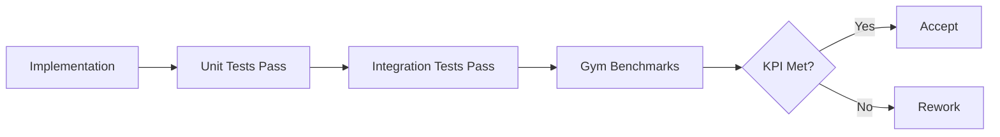

# Q3 Acceptance Criteria

> **Purpose**: Prevent aspirational planning and ensure each track delivers measurable, verifiable value.
> **Principle**: Every criterion must be testable; avoid subjective language.

---

## Acceptance Workflow

---

## Test Command Conventions

- Track X and Y tests should be tagged with AC IDs and executed via `pnpm test:x1` through `pnpm test:y4`.
- Track Z tests run via `pnpm test:z1` and `pnpm test:z2`.
- Use `pnpm test:q3` to run the full Q3 AC suite before declaring completion.

---

## Track X: Deep Code Perception

### Must-pass test cases

| ID | Scenario | Input | Expected Output | Test Command |
|----|----------|-------|-----------------|--------------|
| X-AC-1 | Symbol resolution | "Find the AuthService class" | Correct file path and line number | `pnpm test:x1` |
| X-AC-2 | Reference search | "findReferences('login')" | 3 or more call sites | `pnpm test:x2` |
| X-AC-3 | Safe rename | "rename UserService -> AccountService" | Imports updated, 0 compile errors | `pnpm test:x3` |
| X-AC-4 | Impact analysis | "Edit utils/auth.ts" | List of affected files | `pnpm test:x4` |

### Quantitative KPIs

| Metric | Baseline | Target | Measurement |
|--------|----------|--------|-------------|
| Symbol resolution success rate | N/A | >95% | agent-gym symbol suite |
| Hallucination rate | N/A | <1% | agent-gym code validation |
| LSP response latency | N/A | <100ms | P95 latency monitoring |

### Deliverables checklist

- [ ] `packages/agent-runtime/src/lsp/` exists and includes `LSPService.ts`
- [ ] `SymbolGraph` is exported with full type coverage
- [ ] `nav_def`, `nav_refs`, `rename_sym` tools are registered in MCP
- [ ] 10 or more unit tests cover core logic

---

## Track Y: Adaptive Learning

### Must-pass test cases

| ID | Scenario | Input | Expected Output | Test Command |
|----|----------|-------|-----------------|--------------|
| Y-AC-1 | Preference learning | User says "Do not use var" | Rule is persisted to LessonStore | `pnpm test:y1` |
| Y-AC-2 | Cross-session memory | New session, agent generates code | Output contains no `var` | `pnpm test:y2` |
| Y-AC-3 | Rule deletion | User deletes a rule | Next output can include `var` | `pnpm test:y3` |
| Y-AC-4 | Noise filtering | Unrelated task | Unrelated rules are not applied | `pnpm test:y4` |

### Quantitative KPIs

| Metric | Baseline | Target | Measurement |
|--------|----------|--------|-------------|
| Recall Precision@1 | N/A | >90% | agent-gym memory suite |
| Rule adherence | N/A | 100% | 10 preference tests |
| Retrieval latency | N/A | <50ms | P95 at 1000 rules |

### Deliverables checklist

- [ ] `packages/agent-runtime-memory/src/lessons/` exists
- [ ] `Lesson` type includes `trigger`, `rule`, `confidence`
- [ ] SQLite VSS or LanceDB vector storage is supported
- [ ] Cowork app can view and delete learned rules

---

## Track Z: Agent Gym

### Must-pass test cases

| ID | Scenario | Input | Expected Output | Test Command |
|----|----------|-------|-----------------|--------------|
| Z-AC-1 | Harness boot | Empty project | Agent runtime initializes | `pnpm test:z1` |
| Z-AC-2 | Scoring engine | Syntax-error code | Returns `{pass: false, reason: "syntax"}` | `pnpm test:z2` |
| Z-AC-3 | CI integration | PR submission | GitHub Action runs and reports IQ | `gh workflow run gym` |
| Z-AC-4 | Regression detection | Lower model quality | CI fails and blocks merge | Manual verification |

### Quantitative KPIs

| Metric | Baseline | Target | Measurement |
|--------|----------|--------|-------------|
| Easy suite pass rate | N/A | >90% | 10 easy tasks |
| Medium suite pass rate | N/A | >70% | 15 medium tasks |
| Runtime | N/A | <5min | Easy suite runtime |

### Deliverables checklist

- [ ] `packages/agent-gym/` package exists
- [ ] `benchmarks/` includes 50 or more test scenarios
- [ ] `.github/workflows/gym.yml` CI workflow exists
- [ ] IQ score is visible in Cowork developer settings

---

## Overall Acceptance Criteria

If any condition fails, Q3 is not complete:

1. All AC tests pass: `pnpm test:q3` exits with 0 errors.
2. CI IQ Gate works: at least one PR is blocked by a regression.
3. No regressions: existing `agent-runtime` tests pass.
4. Documentation updated: each track has a walkthrough doc.

---

## Walkthrough References

- Track X: [track-x-walkthrough.md](./track-x-walkthrough.md)
- Track Y: [track-y-walkthrough.md](./track-y-walkthrough.md)
- Track Z: [track-z-walkthrough.md](./track-z-walkthrough.md)

---

## Acceptance Schedule

| Milestone | Date | Scope |
|-----------|------|-------|
| M1 complete | 2026-04-30 | Track X (X-AC-1, X-AC-2, X-AC-3) |
| M2 complete | 2026-05-31 | Track X (X-AC-4) + Track Y (Y-AC-1, Y-AC-2) |
| M3 complete | 2026-06-30 | Track Y (Y-AC-3, Y-AC-4) + Track Z all |
| Q3 final acceptance | 2026-07-07 | All acceptance criteria met |
