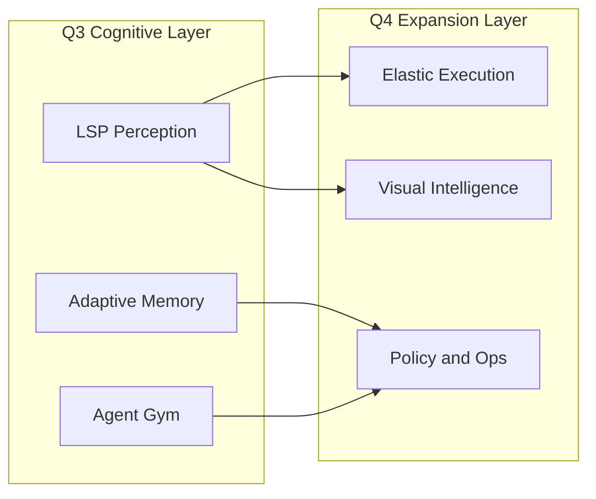
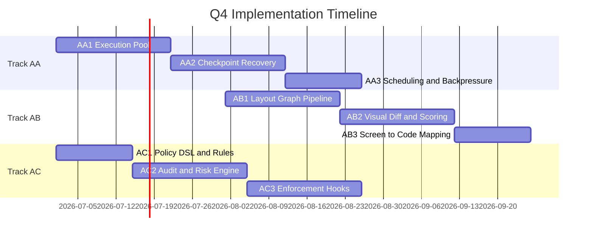

# Q4 Roadmap: The Expansion Layer

Date: 2026-07-10
Owner: Keep-Up Engineering
Status: Completed
Dependencies: Q3 Cognitive Layer (Track X/Y/Z), Q2 Graph Runtime, AI Envelope (LFCC)
Analysis: .tmp/analysis/ (gemini-cli, open-interpreter, cline, autogen, langgraph)

---

## Overview

Q3 delivers perception, memory, and evaluation. Q4 expands the platform into
scalable execution, visual understanding, and operational governance. The goal
is to move from a single high-skill agent to a reliable, multi-workload system
that can operate safely across large codebases and UI-heavy tasks.

---

## Guiding Principles

- Determinism before throughput.
- Fail closed on policy decisions and tool resolution.
- Observable by default: every decision emits telemetry.
- Local-first storage; external backends are out of scope for Q4.

---

## Scope

- Elastic execution: scheduling, backpressure, and fast checkpoint resume.
- Visual intelligence: layout graph, visual diff, and screen-to-code mapping.
- Policy and ops governance: rule engine, audit trail, and CI enforcement.

---

## Key Outcomes and KPIs

| Outcome | Target | Measurement |
| --- | --- | --- |
| Resume latency (P95) | <1s | checkpoint replay benchmarks |
| Visual diff false positives | <1% | UI regression suite |
| Policy decision latency (P95) | <10ms | policy micro-benchmarks |

---

## Dependencies and Inputs

- Q3 Cognitive Layer: `docs/roadmap/phase-4-cognition/README.md`
- Q3 Acceptance Criteria: `docs/roadmap/phase-4-cognition/acceptance-criteria.md`
- Q2 Graph Runtime: `docs/roadmap/phase-3-graph/track-s-graph-runtime.md`
- AI Envelope: `docs/roadmap/phase-1-foundation/core/track-g-ai-envelope-lfcc.md`
- Design system tokens: `docs/roadmap/ui-cowork/track-2-components.md`
- KeepUpGym runner: `packages/agent-gym/src/cli/run.ts`

---

## Source Analysis Summary

- Gemini CLI: task execution, cancellation, and state persistence patterns.
- Cline: command policy enforcement with operator and injection detection.
- Open Interpreter: UI task loop and computer-use workflows.
- AutoGen: runtime queue semantics and message delivery guarantees.
- LangGraph: concurrent task runner and commit patterns.

---

## Integration Points

- `packages/agent-runtime/` execution plane and policy hooks.
- `packages/agent-runtime-tools/` new tools for layout and policy context.
- `packages/agent-runtime-telemetry/` audit and KPI emission.
- `packages/agent-gym/` benchmark suites for scale, vision, and safety.
- `apps/cowork/` UI for policy rules, audits, and visual diffs.

---

## Tracks

### Track AA: Elastic Execution and Scale
Status: Completed | Priority: Critical | Timeline: Month 1-2

Build a multi-worker execution plane with scheduling, backpressure, and fast
checkpoint recovery. This enables high concurrency without losing determinism.

Details: track-aa-elastic-execution.md

### Track AB: Visual Intelligence and Layout Graph
Status: Completed | Priority: High | Timeline: Month 2-3

Add a visual sense layer for UI and document tasks. The agent should reason
about layout, diffs, and mapping from screen regions to code.

Details: track-ab-visual-intelligence.md

### Track AC: Policy and Ops Governance
Status: Completed | Priority: High | Timeline: Month 1-3

Introduce a policy engine and audit plane to enforce safe tool usage and
ensure compliance, with explicit allow/deny rules and full traceability.

Details: track-ac-policy-ops.md

---

## Track Index

| Track | Focus | Priority | Timeline | Document |
| --- | --- | --- | --- | --- |
| AA | Elastic Execution and Scale | Critical | Month 1-2 | track-aa-elastic-execution.md |
| AB | Visual Intelligence and Layout Graph | High | Month 2-3 | track-ab-visual-intelligence.md |
| AC | Policy and Ops Governance | High | Month 1-3 | track-ac-policy-ops.md |
| Q4-AC | Acceptance Criteria | Critical | - | acceptance-criteria.md |

---

## Supporting Docs

- Q4 Gym Extensions: `docs/roadmap/phase-5-expansion/benchmarks.md`
- Q4 Parallel Development Interface Freeze: `docs/roadmap/phase-5-expansion/parallel-development.md`

---

## Timeline (3 Months)

Month 1 (July)
- AA1: Execution pool and worker registry
- AC1: Policy DSL and rule evaluation

Month 2 (August)
- AA2: Checkpoint recovery and lease-based resume
- AB1: Layout graph pipeline
- AC2: Audit and risk engine

Month 3 (September)
- AA3: Scheduling, backpressure, and quotas
- AB2/AB3: Visual diff and screen to code mapping
- AC3: Enforcement hooks and CI gates

---

## Definition of Done (All Tracks)

- APIs and contracts implemented per track specification.
- Targeted unit and integration tests for each track.
- No regression in Q2/Q3 runtime and tool contracts.
- Documentation updated and walkthrough steps recorded.
- Gym metrics extended for scale, visual quality, and policy compliance.
- Q4 Gym baselines and reports published for CI gating.

---

## Implementation Readiness Checklist

- Decisions locked (storage, thresholds, policy location).
- Data models defined for execution, vision, and policy.
- Artifact types and config surfaces specified.
- Gym categories and min-score thresholds defined.
- Validation commands scoped and runnable from repo root.

---

## Risks and Mitigations

| Risk | Impact | Mitigation |
| --- | --- | --- |
| Scheduler starvation | Task delays | Priority lanes and quota caps |
| Visual false positives | Flaky gating | Threshold tuning and gold baselines |
| Policy bypass via tool aliasing | Security gaps | Canonical tool resolution |

---

## Decisions (Locked for Implementation)

- Execution lease storage is SQLite only in Q4 via `packages/agent-runtime-persistence`. External backends are out of scope.
- Screen-to-code auto-apply threshold is 0.85 confidence; below this value requires manual review.
- Policy rules are stored in Cowork settings as versioned JSON. Cowork UI supports export to `.keepup/policy.json` for repo-local overrides.
- All MCP tools must declare `annotations.policyAction` for policy evaluation.

---

## Out of Scope

Voice and avatar interaction surfaces remain a Q5 candidate and are not part of
this quarter.
