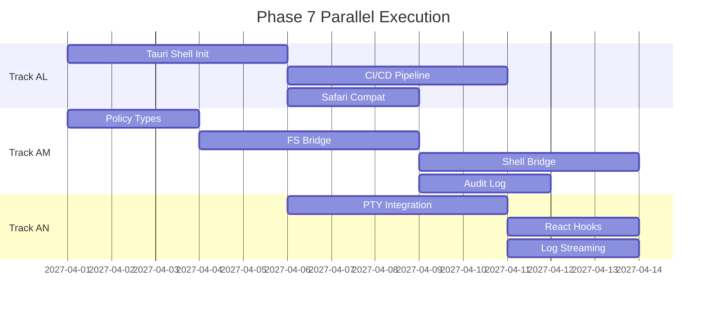
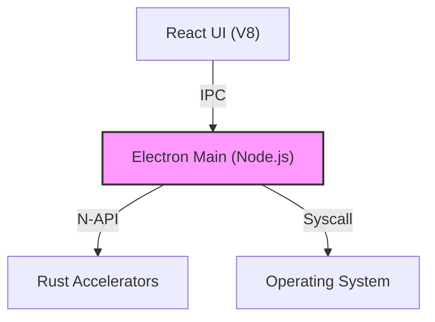
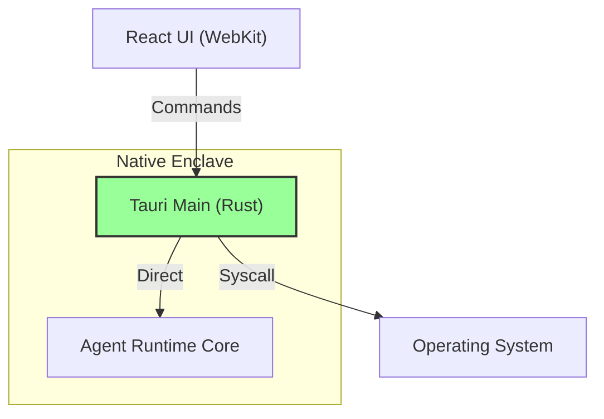

# Phase 7: Desktop Sovereignty & Native Convergence

> **Status**: Completed
> **Owner**: Agent Runtime Team
> **Dependencies**: Phase 6 (Rust Native) partial completion, `sandbox-rs` stable
> **Timeline**: Delivered (Q2-Q3 2027)

---

## Overview

Phase 7 marks the transition from a web-first application to a **Local-First Native Application**.

While Phase 6 introduced Rust accelerators as N-API libraries, Phase 7 integrates them into a cohesive Application Shell using **Tauri 2.0**. This eliminates Node.js dependency for the desktop wrapper, drastically reduces memory footprint, and establishes a secure-by-default environment for the Agent Runtime.

---

## Core Objectives

| Objective | Description | Measure |
| :--- | :--- | :--- |
| **Sovereignty** | Agent Runtime runs as a native OS service, independent of UI thread | Runtime survives UI reload |
| **Security** | FS/Shell access brokered strictly by Rust policies | Zero JS bypass paths |
| **Performance** | UI communicates directly with Rust Core for high-frequency data | < 16ms latency for events |

---

## Track Index (Parallelizable)

| Track | Focus | Priority | Est. Effort | Dependencies | Document |
| :--- | :--- | :--- | :--- | :--- | :--- |
| **AL** | Tauri Shell Migration | **P0** | 2 weeks | None | [track-al-tauri-migration.md](./track-al-tauri-migration.md) |
| **AM** | Native Security Enclave | **P0** | 3 weeks | AL (basic shell) | [track-am-native-enclave.md](./track-am-native-enclave.md) |
| **AN** | Direct UI Streams | **P1** | 2 weeks | AL | [track-an-direct-streams.md](./track-an-direct-streams.md) |
| **AO** | Local Vector Store | **P2** | 2 weeks | AM (policy) | [track-ao-local-vector-store.md](./track-ao-local-vector-store.md) |

### Parallelization Strategy

---

## Architecture Evolution

### Before (Electron / Phase 5)

### After (Tauri / Phase 7)

---

## Success Metrics

| Metric | Benchmark (Electron) | Target (Tauri) | Validation |
| :--- | :--- | :--- | :--- |
| **Installer Size** | ~120 MB | **< 20 MB** | `du -sh dist/*.dmg` |
| **Cold Startup** | ~4s | **< 800ms** | Stopwatch, CI benchmark |
| **Idle Memory** | ~200 MB | **< 50 MB** | Activity Monitor |
| **IPC Latency** | ~5ms (N-API) | **< 0.5ms** (in-process) | Micro-benchmark |

---

## Prerequisites

Before starting Phase 7, ensure:

- [ ] Rust toolchain installed (`rustup`)
- [ ] `packages/sandbox-rs` builds and passes tests
- [ ] **Technical Debt**: Refactor `packages/*-rs` to export `rlib` for Tauri linking (Track AL)
- [ ] `packages/canonicalizer-rs` builds and passes tests
- [ ] Safari on macOS verified to load `apps/cowork` (basic smoke test)
- [ ] CI has Rust + Tauri build capability (or will be added in Track AL)

---

## Readiness Checklist

- [x] Tauri vs Electron evaluation complete ([tauri-evaluation.md](../../architecture/tauri-evaluation.md))
- [x] Track documents created with detailed implementation tasks
- [ ] Safari compatibility smoke test passed
- [ ] Feature flag `desktop.shell = tauri | electron` defined

---

## Rollout Plan

1. **Alpha** (Week 4): Internal dogfooding with `tauri | electron` flag.
2. **Beta** (Week 6): Public beta with opt-in Tauri builds.
3. **GA** (Week 8): Tauri default, Electron deprecated.

---

## Non-Goals

The following are **out of scope** for Phase 7:

- Full Agent Runtime port to Rust (orchestrator stays TypeScript)
- iOS/Android mobile builds (Tauri 2 supports them, but not this phase)
- Chrome Extension (remains unchanged)

---

## Reference Material

- [Tauri Evaluation](../../architecture/tauri-evaluation.md)
- [Phase 6 Accelerators](../phase-6-rust-native/README.md)
- [Cowork Desktop Integration Spec](../../specs/cowork/cowork-desktop-integration.md)
- [Tauri 2.0 Documentation](https://tauri.app/start/)
