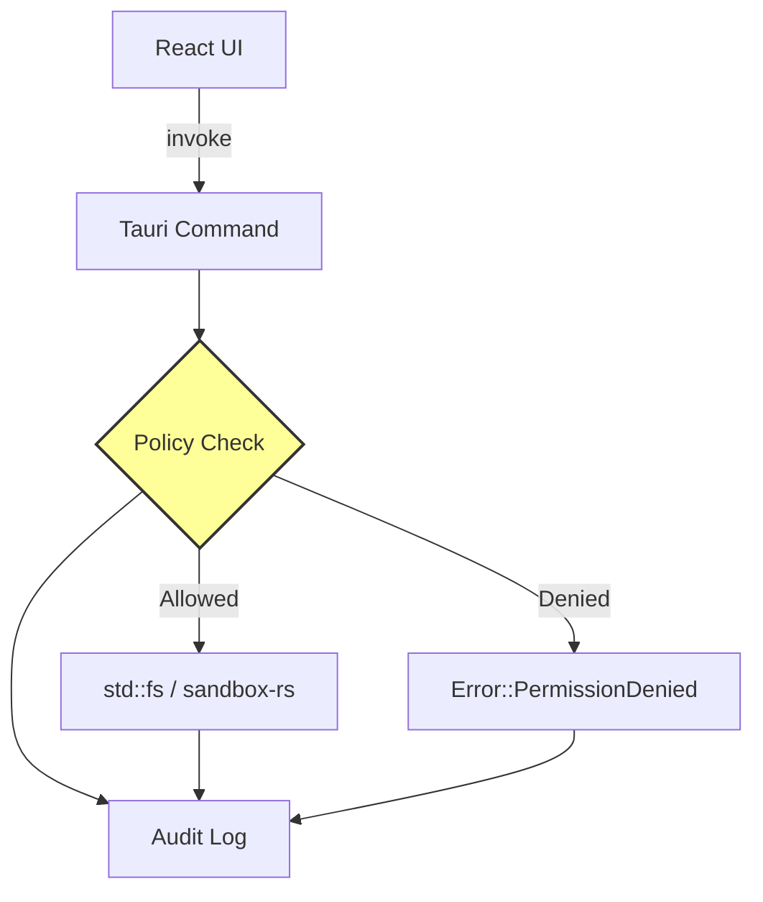

# Track AM: Native Security Enclave

> **Priority**: P0
> **Status**: Ready
> **Owner**: Security Team
> **Dependencies**: Track AL (basic shell + crate refactoring)
> **Estimated Effort**: 3 weeks

---

## Overview

Implement the "Sandbox Adapter" logic directly in Rust within the Tauri process. This creates a hard security boundary that compromised JavaScript cannot bypass.

---

## Problem Definition

| Problem | Current Implementation | Impact |
| :--- | :--- | :--- |
| Self-policing | TS Runtime checks own policies | Supply chain attack can bypass |
| Path traversal | `path.resolve()` comparisons | Symlink attacks possible |
| Audit gaps | Logging in JS (mutable) | Tamper risk |

---

## Deliverables

### D1: Policy State Manager
- Rust struct `EnclavePolicy` holding active grants
- Thread-safe state via `tauri::State<Mutex<EnclavePolicy>>`
- API to update policy from UI (with authentication)

### D2: File System Bridge
- `fs_read(path) -> Result<Vec<u8>>` with policy check
- `fs_write(path, content) -> Result<()>` with policy check
- `fs_list(path) -> Result<Vec<FileEntry>>` with policy check
- Path canonicalization via `packages/canonicalizer-rs`

### D3: Shell Execution Bridge
- `shell_exec(cmd, args, cwd) -> Result<Output>` with command allowlist
- Integration with `packages/sandbox-rs` for OS isolation
- Streaming output via Tauri events

### D4: Audit Log
- Append-only in-memory ring buffer
- Entries: timestamp, action, path, decision, user_id
- Exportable to file for compliance

---

## Technical Design

### Architecture


### Core Types (`src-tauri/src/enclave/types.rs`)
```rust
use std::path::PathBuf;
use std::collections::HashSet;

#[derive(Debug, Clone, Default)]
pub struct EnclavePolicy {
    /// Allowed root directories for read/write
    pub allowed_roots: HashSet<PathBuf>,
    /// Allowed shell commands (exact match or prefix)
    pub allowed_commands: HashSet<String>,
    /// Network allowlist (hostnames)
    pub allowed_hosts: HashSet<String>,
    /// Session ID for audit correlation
    pub session_id: String,
}

#[derive(Debug, Clone, serde::Serialize)]
pub struct AuditEntry {
    pub timestamp: i64,
    pub action: String,
    pub target: String,
    pub decision: Decision,
    pub session_id: String,
}

#[derive(Debug, Clone, serde::Serialize)]
pub enum Decision {
    Allowed,
    Denied { reason: String },
    NeedsConfirmation,
}
```

### Command Implementation (`src-tauri/src/enclave/commands.rs`)
```rust
use tauri::State;
use std::sync::Mutex;

#[tauri::command]
pub async fn fs_read(
    path: String,
    state: State<'_, Mutex<EnclavePolicy>>,
    audit: State<'_, Mutex<AuditLog>>,
) -> Result<Vec<u8>, String> {
    let policy = state.lock().map_err(|e| e.to_string())?;
    
    // 1. Canonicalize path
    let canonical = canonicalizer_rs::canonicalize(&path)
        .map_err(|e| format!("Invalid path: {e}"))?;
    
    // 2. Check policy
    if !policy.is_path_allowed(&canonical) {
        audit.lock().unwrap().log(AuditEntry {
            action: "fs_read".into(),
            target: path.clone(),
            decision: Decision::Denied { reason: "Path not in allowed roots".into() },
            ..Default::default()
        });
        return Err("Permission denied".into());
    }
    
    // 3. Read file
    let content = std::fs::read(&canonical)
        .map_err(|e| format!("Read error: {e}"))?;
    
    // 4. Audit success
    audit.lock().unwrap().log(AuditEntry {
        action: "fs_read".into(),
        target: path,
        decision: Decision::Allowed,
        ..Default::default()
    });
    
    Ok(content)
}
```

---

## Implementation Plan

| Week | Deliverable | Tasks |
| :--- | :--- | :--- |
| 1 | D1 Policy Manager | Define types, implement state management, add UI update command |
| 1 | D4 Audit (basic) | Ring buffer implementation, log macro |
| 2 | D2 FS Bridge | `fs_read`, `fs_write`, `fs_list` with canonicalization |
| 2 | Integration | Connect to existing GrantManager UI signals |
| 3 | D3 Shell Bridge | `shell_exec` with sandbox-rs integration |
| 3 | D4 Audit (export) | File export, UI display component |

---

## Affected Code

| Path | Change Type | Description |
| :--- | :--- | :--- |
| `apps/desktop-tauri/src-tauri/src/enclave/` | **NEW** | Core enclave module |
| `apps/desktop-tauri/src-tauri/Cargo.toml` | Modify | Add `canonicalizer-rs`, `sandbox-rs` deps |
| `packages/agent-runtime/src/sandbox/` | Modify | Route calls through Tauri when in desktop mode |
| `apps/cowork/client/hooks/useEnclave.ts` | **NEW** | React hooks for enclave commands |

---

## Acceptance Criteria

- [ ] DevTools console `invoke('fs_read', {path: '/etc/passwd'})` returns "Permission denied"
- [ ] Granting folder via UI updates Rust policy immediately
- [ ] `invoke('fs_read', {path: '/granted/folder/file.txt'})` succeeds
- [ ] Path with `../` that escapes granted root is blocked
- [ ] Symlink pointing outside granted root is blocked
- [ ] All blocked actions appear in Audit Log UI
- [ ] `shell_exec` spawns process in sandbox (macOS: Seatbelt active)
- [ ] Audit log exportable to JSON file

---

## Rollout Plan

- **Feature Flag**: `ENCLAVE_MODE=rust | legacy`
- **Week 1**: Rust enclave active for read-only operations
- **Week 2**: Rust enclave active for write operations
- **Week 3**: Rust enclave active for shell execution, legacy removed

---

## Security Considerations

| Threat | Mitigation |
| :--- | :--- |
| TOCTOU race | Canonicalize immediately before access |
| Symlink escape | Resolve symlinks and re-check canonical path |
| Command injection | `shell_exec` uses array args, not string interpolation |
| Audit tampering | Rust-only write access, append-only buffer |

---

## Alternatives Considered

| Alternative | Pros | Cons | Decision |
| :--- | :--- | :--- | :--- |
| Keep TS policy | No code change | Bypassable | Rejected |
| External daemon | Process isolation | IPC overhead, complexity | Rejected |
| In-process Rust | Zero overhead, unbypässable | Requires Tauri | **Chosen** |

---

## References

- [sandbox-rs Package](file:///Users/han/Documents/Code/Parallel/keep-up/packages/sandbox-rs/Cargo.toml)
- [canonicalizer-rs Package](file:///Users/han/Documents/Code/Parallel/keep-up/packages/canonicalizer-rs/Cargo.toml)
- [Track AD: Sandbox Sidecar](../phase-6-rust-native/track-ad-sandbox-sidecar.md)
- [Cowork Safety Spec](../../specs/cowork/cowork-safety-spec.md)

---

## Commands

### Test Policy Enforcement
```bash
# In Tauri dev mode, open DevTools and run:
await window.__TAURI__.core.invoke('fs_read', { path: '/etc/passwd' })
# Expected: Error "Permission denied"

# After granting ~/projects via UI:
await window.__TAURI__.core.invoke('fs_read', { path: '/Users/you/projects/file.txt' })
# Expected: File contents
```

### Test Symlink Escape
```bash
# Create escape symlink
ln -s /etc/passwd ~/projects/escape.txt

# Try to read via Tauri
await window.__TAURI__.core.invoke('fs_read', { path: '/Users/you/projects/escape.txt' })
# Expected: Error "Permission denied" (symlink target outside allowed roots)
```

### Verify Audit Log
```bash
await window.__TAURI__.core.invoke('get_audit_log', { limit: 100 })
# Expected: Array of AuditEntry objects
```
