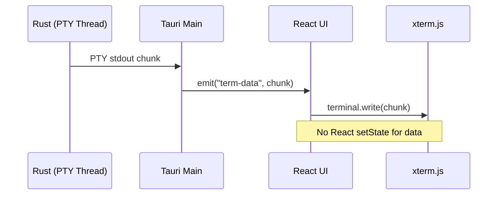

# Track AN: Direct UI Streams

> **Priority**: P1
> **Status**: Ready
> **Owner**: UI Platform Team
> **Dependencies**: Track AL (Tauri shell running)
> **Estimated Effort**: 2 weeks

---

## Overview

Establish high-performance, zero-latency streaming channels for high-frequency data (Terminal Output, Log Stream, File Watcher Events) from the Rust backend to the React UI.

---

## Problem Definition

| Problem | Current Implementation | Impact |
| :--- | :--- | :--- |
| Serialization overhead | Node.js JSON -> WebSocket -> React | Latency, GC pressure |
| UI freeze on large output | `cat huge.log` blocks render | Poor UX |
| Double buffering | Node.js buffer + React state | Memory waste |

---

## Deliverables

### D1: Terminal PTY Stream
- Rust pseudo-terminal management via `portable-pty`
- Binary chunk streaming via Tauri events
- Direct write to `xterm.js` (bypass React state)

### D2: Log Stream
- Custom `tracing::Subscriber` forwarding to webview
- Batched events (16ms debounce window)
- Structured JSON entries with levels

### D3: File Watcher Stream
- Rust `notify` crate integration
- Debounced file change events
- Path filtering based on policy

### D4: React Hooks
- `useNativeTerminal()` - connects xterm.js to PTY stream
- `useNativeLogs()` - virtualized log viewer
- `useFileWatcher()` - file tree refresh triggers

---

## Technical Design

### Architecture


### PTY Manager (`src-tauri/src/terminal/mod.rs`)
```rust
use portable_pty::{native_pty_system, CommandBuilder, PtySize};
use tauri::{AppHandle, Manager};
use std::io::Read;
use std::thread;

pub struct PtyManager {
    sessions: std::sync::Mutex<HashMap<String, PtySession>>,
}

struct PtySession {
    master: Box<dyn portable_pty::MasterPty + Send>,
    child: Box<dyn portable_pty::Child + Send>,
}

#[tauri::command]
pub async fn spawn_terminal(
    id: String,
    cmd: String,
    args: Vec<String>,
    cwd: String,
    app: AppHandle,
    manager: tauri::State<'_, PtyManager>,
) -> Result<(), String> {
    let pty_system = native_pty_system();
    let pair = pty_system.openpty(PtySize {
        rows: 24,
        cols: 80,
        pixel_width: 0,
        pixel_height: 0,
    }).map_err(|e| e.to_string())?;

    let mut cmd_builder = CommandBuilder::new(&cmd);
    cmd_builder.args(&args);
    cmd_builder.cwd(&cwd);

    let child = pair.slave.spawn_command(cmd_builder)
        .map_err(|e| e.to_string())?;

    let mut reader = pair.master.try_clone_reader()
        .map_err(|e| e.to_string())?;

    let event_id = id.clone();
    let app_clone = app.clone();
    
    // Spawn reader thread
    thread::spawn(move || {
        let mut buffer = [0u8; 4096];
        loop {
            match reader.read(&mut buffer) {
                Ok(0) => break, // EOF
                Ok(n) => {
                    let chunk = &buffer[..n];
                    let _ = app_clone.emit(&format!("term-data-{}", event_id), chunk);
                }
                Err(_) => break,
            }
        }
        let _ = app_clone.emit(&format!("term-exit-{}", event_id), ());
    });

    manager.sessions.lock().unwrap().insert(id, PtySession {
        master: pair.master,
        child,
    });

    Ok(())
}

#[tauri::command]
pub fn write_terminal(
    id: String,
    data: Vec<u8>,
    manager: tauri::State<'_, PtyManager>,
) -> Result<(), String> {
    let mut sessions = manager.sessions.lock().unwrap();
    let session = sessions.get_mut(&id).ok_or("Session not found")?;
    
    let mut writer = session.master.take_writer()
        .map_err(|e| e.to_string())?;
    writer.write_all(&data).map_err(|e| e.to_string())?;
    
    Ok(())
}
```

### React Hook (`apps/cowork/client/hooks/useNativeTerminal.ts`)
```typescript
import { useEffect, useRef } from 'react';
import { listen, invoke } from '@tauri-apps/api/core';
import type { Terminal } from 'xterm';

export function useNativeTerminal(terminalRef: React.RefObject<Terminal | null>) {
  const sessionId = useRef<string | null>(null);

  useEffect(() => {
    if (!terminalRef.current) return;

    const terminal = terminalRef.current;
    const id = crypto.randomUUID();
    sessionId.current = id;

    // Listen for PTY output
    const unlistenData = listen<Uint8Array>(`term-data-${id}`, (event) => {
      terminal.write(event.payload);
    });

    const unlistenExit = listen(`term-exit-${id}`, () => {
      terminal.writeln('\r\n[Process exited]');
    });

    // Handle user input
    const disposable = terminal.onData((data) => {
      invoke('write_terminal', { id, data: Array.from(new TextEncoder().encode(data)) });
    });

    // Spawn shell
    invoke('spawn_terminal', {
      id,
      cmd: process.platform === 'win32' ? 'cmd.exe' : '/bin/zsh',
      args: [],
      cwd: process.cwd(),
    });

    return () => {
      unlistenData.then((fn) => fn());
      unlistenExit.then((fn) => fn());
      disposable.dispose();
      invoke('kill_terminal', { id: sessionId.current });
    };
  }, [terminalRef]);

  return sessionId;
}
```

---

## Implementation Plan

| Day | Deliverable | Tasks |
| :--- | :--- | :--- |
| 1-2 | D1 PTY Core | Add `portable-pty` dep, implement spawn/read/write |
| 3-4 | D4 Terminal Hook | Create `useNativeTerminal`, integrate with existing Terminal component |
| 5-6 | D2 Log Stream | Implement `TracingSubscriber`, batching, React hook |
| 7-8 | D3 File Watcher | Integrate `notify`, debounce, connect to file tree |
| 9-10 | Polish | Performance benchmarks, edge cases, documentation |

---

## Affected Code

| Path | Change Type | Description |
| :--- | :--- | :--- |
| `apps/desktop-tauri/src-tauri/src/terminal/` | **NEW** | PTY management module |
| `apps/desktop-tauri/src-tauri/src/logging/` | **NEW** | Tracing subscriber |
| `apps/desktop-tauri/src-tauri/src/watcher/` | **NEW** | File watcher module |
| `apps/desktop-tauri/src-tauri/Cargo.toml` | Modify | Add `portable-pty`, `notify`, `tracing-subscriber` |
| `apps/cowork/client/hooks/useNativeTerminal.ts` | **NEW** | Terminal React hook |
| `apps/cowork/client/hooks/useNativeLogs.ts` | **NEW** | Logs React hook |
| `apps/cowork/client/components/Terminal/` | Modify | Use native hook when in Tauri |

---

## Acceptance Criteria

- [ ] `pnpm tauri dev` -> Terminal tab shows working shell
- [ ] Typing in terminal has < 16ms input latency
- [ ] `cat` a 10MB file completes without UI freeze
- [ ] Scrollback buffer handles 100k lines without lag
- [ ] Log stream shows Rust `tracing` events in real-time
- [ ] File watcher triggers tree refresh on external file change
- [ ] Memory usage stable during long terminal sessions

---

## Performance Benchmarks

| Metric | Target | Validation |
| :--- | :--- | :--- |
| Input latency | < 16ms | DevTools Performance |
| Throughput | > 10 MB/s | `cat /dev/urandom > output` |
| Memory (100k lines) | < 50MB terminal buffer | Activity Monitor |
| Event batch delay | 16ms max | Timestamp diff logging |

---

## Rollout Plan

- **Feature Flag**: `TERMINAL_MODE=native | legacy`
- **Day 1**: Native terminal opt-in for testing
- **Day 5**: Native terminal default, legacy fallback
- **Day 10**: Legacy terminal removed

---

## Alternatives Considered

| Alternative | Pros | Cons | Decision |
| :--- | :--- | :--- | :--- |
| WebSocket from Node | Works today | Extra process, latency | Rejected |
| Shared ArrayBuffer | Zero-copy | Complex, COOP headers | Deferred |
| Tauri Events | Simple, fast enough | Slight overhead | **Chosen** |

---

## References

- [portable-pty crate](https://docs.rs/portable-pty)
- [xterm.js documentation](https://xtermjs.org/)
- [Tauri Events API](https://tauri.app/develop/inter-process-communication/)
- [tracing-subscriber](https://docs.rs/tracing-subscriber)

---

## Commands

### Test Terminal Throughput
```bash
# In Tauri terminal, run:
dd if=/dev/zero bs=1M count=100 | cat

# Should complete in ~10 seconds with no UI freeze
```

### Debug Event Latency
```typescript
// Add to useNativeTerminal temporarily
const start = performance.now();
terminal.onData(() => {
  console.log('Input latency:', performance.now() - start);
});
```

### Verify Memory Stability
```bash
# Run in terminal for 5 minutes:
yes | head -n 1000000

# Check Activity Monitor - memory should plateau, not grow indefinitely
```
