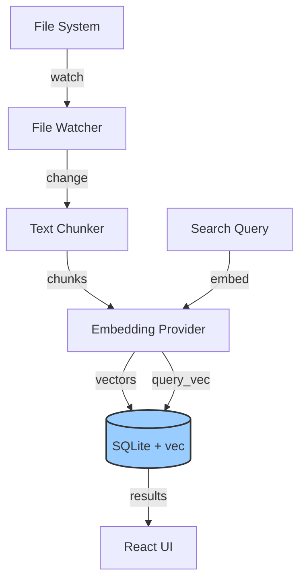

# Track AO: Local Vector Store

> **Priority**: P2 (Enhancement)
> **Status**: Ready
> **Owner**: AI/ML Team
> **Dependencies**: Track AL (crate refactoring), Track AM (policy)
> **Estimated Effort**: 2 weeks

---

## Overview

Embed a vector database capability directly into the desktop application, enabling "Memory" (RAG) functionality without sending embeddings or context to a remote vector database service.

---

## Problem Definition

| Problem | Current Implementation | Impact |
| :--- | :--- | :--- |
| Privacy risk | Embeddings sent to cloud | User data exposure |
| Latency | Network round-trip | Slow context retrieval |
| Cost | Per-query pricing | Scales with usage |
| Offline unavailable | Requires internet | No offline mode |

---

## Deliverables

### D1: SQLite Vector Extension
- Bundled `sqlite-vec` extension in Tauri app
- Schema for embeddings storage (vectors, metadata, timestamps)
- Basic CRUD operations

### D2: Ingestion Pipeline
- File change detection -> chunking -> embedding -> storage
- Configurable embedding provider (local or API)
- Background processing with progress events

### D3: Search API
- Semantic search command: `search(query, limit, filters)`
- Hybrid search: vector similarity + keyword match
- Result ranking and deduplication

### D4: React Integration
- `useSemanticSearch()` hook
- Context panel with search results
- Memory management UI (view/delete stored items)

---

## Technical Design

### Architecture


### Database Schema
```sql
-- Vector storage table
CREATE VIRTUAL TABLE IF NOT EXISTS embeddings USING vec0(
    embedding float[384]  -- Dimension depends on model
);

-- Metadata table
CREATE TABLE IF NOT EXISTS chunks (
    id INTEGER PRIMARY KEY,
    file_path TEXT NOT NULL,
    chunk_index INTEGER NOT NULL,
    content TEXT NOT NULL,
    token_count INTEGER,
    created_at INTEGER NOT NULL,
    updated_at INTEGER NOT NULL,
    embedding_id INTEGER REFERENCES embeddings(rowid),
    UNIQUE(file_path, chunk_index)
);

-- File tracking
CREATE TABLE IF NOT EXISTS indexed_files (
    path TEXT PRIMARY KEY,
    hash TEXT NOT NULL,
    indexed_at INTEGER NOT NULL
);

CREATE INDEX idx_chunks_file ON chunks(file_path);
CREATE INDEX idx_chunks_updated ON chunks(updated_at);
```

### Core Types (`src-tauri/src/vectorstore/types.rs`)
```rust
use serde::{Deserialize, Serialize};

#[derive(Debug, Clone, Serialize, Deserialize)]
pub struct Chunk {
    pub id: i64,
    pub file_path: String,
    pub chunk_index: i32,
    pub content: String,
    pub token_count: i32,
}

#[derive(Debug, Clone, Serialize, Deserialize)]
pub struct SearchResult {
    pub chunk: Chunk,
    pub score: f32,
    pub highlights: Vec<String>,
}

#[derive(Debug, Clone, Deserialize)]
pub struct SearchQuery {
    pub query: String,
    pub limit: usize,
    pub file_filter: Option<Vec<String>>,
    pub min_score: Option<f32>,
}

#[derive(Debug, Clone, Serialize)]
pub struct IndexProgress {
    pub total_files: usize,
    pub processed_files: usize,
    pub current_file: String,
    pub status: IndexStatus,
}

#[derive(Debug, Clone, Serialize)]
pub enum IndexStatus {
    Idle,
    Indexing,
    Paused,
    Error(String),
}
```

### Search Command (`src-tauri/src/vectorstore/commands.rs`)
```rust
use rusqlite::Connection;
use tauri::State;

#[tauri::command]
pub async fn semantic_search(
    query: SearchQuery,
    db: State<'_, std::sync::Mutex<Connection>>,
    embedder: State<'_, Box<dyn Embedder>>,
) -> Result<Vec<SearchResult>, String> {
    // 1. Embed query
    let query_vec = embedder.embed(&query.query)
        .await
        .map_err(|e| e.to_string())?;
    
    // 2. Query vector store
    let conn = db.lock().map_err(|e| e.to_string())?;
    
    let mut stmt = conn.prepare(r#"
        SELECT 
            c.id, c.file_path, c.chunk_index, c.content, c.token_count,
            distance(e.embedding, ?1) AS score
        FROM chunks c
        JOIN embeddings e ON c.embedding_id = e.rowid
        WHERE score < ?2
        ORDER BY score ASC
        LIMIT ?3
    "#).map_err(|e| e.to_string())?;
    
    let results = stmt.query_map(
        rusqlite::params![
            query_vec.as_slice(),
            query.min_score.unwrap_or(1.0),
            query.limit as i64,
        ],
        |row| {
            Ok(SearchResult {
                chunk: Chunk {
                    id: row.get(0)?,
                    file_path: row.get(1)?,
                    chunk_index: row.get(2)?,
                    content: row.get(3)?,
                    token_count: row.get(4)?,
                },
                score: row.get(5)?,
                highlights: vec![],
            })
        },
    ).map_err(|e| e.to_string())?;
    
    results.collect::<Result<Vec<_>, _>>()
        .map_err(|e| e.to_string())
}

#[tauri::command]
pub async fn index_directory(
    path: String,
    app: tauri::AppHandle,
    db: State<'_, std::sync::Mutex<Connection>>,
    embedder: State<'_, Box<dyn Embedder>>,
) -> Result<(), String> {
    // Background indexing with progress events
    tokio::spawn(async move {
        // ... indexing logic with app.emit("index-progress", progress)
    });
    
    Ok(())
}
```

### React Hook (`apps/cowork/client/hooks/useSemanticSearch.ts`)
```typescript
import { useState, useCallback } from 'react';
import { invoke } from '@tauri-apps/api/core';

interface SearchResult {
  chunk: {
    id: number;
    file_path: string;
    chunk_index: number;
    content: string;
    token_count: number;
  };
  score: number;
  highlights: string[];
}

export function useSemanticSearch() {
  const [results, setResults] = useState<SearchResult[]>([]);
  const [loading, setLoading] = useState(false);
  const [error, setError] = useState<string | null>(null);

  const search = useCallback(async (query: string, limit = 10) => {
    if (!query.trim()) {
      setResults([]);
      return;
    }

    setLoading(true);
    setError(null);

    try {
      const searchResults = await invoke<SearchResult[]>('semantic_search', {
        query: { query, limit, fileFilter: null, minScore: 0.3 },
      });
      setResults(searchResults);
    } catch (err) {
      setError(err instanceof Error ? err.message : String(err));
    } finally {
      setLoading(false);
    }
  }, []);

  const clearResults = useCallback(() => {
    setResults([]);
    setError(null);
  }, []);

  return { results, loading, error, search, clearResults };
}
```

---

## Implementation Plan

| Day | Deliverable | Tasks |
| :--- | :--- | :--- |
| 1-2 | D1 SQLite Setup | Bundle sqlite-vec, create schema, test basic ops |
| 3-4 | D2 Ingestion | File watcher -> chunker -> embedder pipeline |
| 5-6 | D3 Search | Implement `semantic_search` command |
| 7-8 | D4 React | Hooks, search panel, memory management UI |
| 9-10 | Polish | Performance tuning, error handling, docs |

---

## Affected Code

| Path | Change Type | Description |
| :--- | :--- | :--- |
| `apps/desktop-tauri/src-tauri/src/vectorstore/` | **NEW** | Vector store module |
| `apps/desktop-tauri/src-tauri/Cargo.toml` | Modify | Add `rusqlite`, `sqlite-vec` deps |
| `apps/cowork/client/hooks/useSemanticSearch.ts` | **NEW** | Search React hook |
| `apps/cowork/client/components/ContextPanel/` | Modify | Add semantic search results |

---

## Acceptance Criteria

- [ ] `index_directory` successfully indexes 1000 files
- [ ] `semantic_search` returns relevant results in < 100ms
- [ ] Search works completely offline (after initial embedding)
- [ ] Memory usage stays under 200MB for 100k chunks
- [ ] UI shows indexing progress with cancel option
- [ ] User can delete indexed items from UI
- [ ] Privacy: no data leaves the device (when using local embedder)

---

## Embedding Provider Options

| Provider | Type | Dimensions | Speed | Quality | Offline |
| :--- | :--- | :--- | :--- | :--- | :--- |
| **all-MiniLM-L6-v2** | Local (ONNX) | 384 | Fast | Good | ✅ |
| **bge-small-en-v1.5** | Local (ONNX) | 384 | Fast | Better | ✅ |
| **OpenAI text-embedding-3-small** | API | 1536 | Medium | Best | ❌ |

**Default**: `all-MiniLM-L6-v2` for privacy and offline support.

---

## Rollout Plan

- **Feature Flag**: `VECTOR_STORE=enabled | disabled`
- **Week 1**: Opt-in for internal testing
- **Week 2**: Stable release, default enabled

---

## Alternatives Considered

| Alternative | Pros | Cons | Decision |
| :--- | :--- | :--- | :--- |
| LanceDB | Rust native, fast | Extra binary, less mature | Deferred |
| Qdrant embedded | Full features | Heavy, complex | Rejected |
| sqlite-vec | Lightweight, SQLite native | Limited features | **Chosen** |

---

## References

- [sqlite-vec](https://github.com/asg017/sqlite-vec)
- [vector-similarity-rs](file:///Users/han/Documents/Code/Parallel/keep-up/packages/vector-similarity-rs/Cargo.toml)
- [tokenizer-rs](file:///Users/han/Documents/Code/Parallel/keep-up/packages/tokenizer-rs/)
- [Sentence Transformers](https://www.sbert.net/)

---

## Commands

### Test Indexing
```bash
# In Tauri DevTools:
await window.__TAURI__.core.invoke('index_directory', { path: '/Users/you/projects' })

# Monitor progress:
await window.__TAURI__.event.listen('index-progress', (e) => console.log(e.payload))
```

### Test Search
```bash
await window.__TAURI__.core.invoke('semantic_search', {
  query: { query: 'authentication middleware', limit: 5 }
})
```

### Check Database Size
```bash
ls -lh ~/Library/Application\ Support/com.keepup.desktop/vectors.db
```
