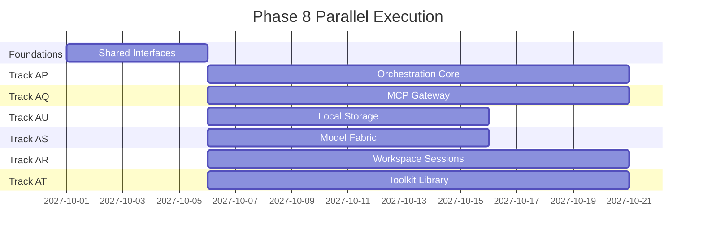

# Phase 8: Rust-First Agent Capabilities

> Status: Proposed
> Owner: Agent Runtime Team
> Dependencies: Phase 6 Rust Native, Phase 7 Desktop Sovereignty
> Timeline: Q4 2027 (8-10 weeks, parallel execution)

---

## Overview

Phase 8 targets parity with the agent capabilities observed in the Eigent reference stack,
implemented with Rust as the primary execution plane. The Open Wrap UI in `apps/cowork`
remains the user-facing surface, while Rust owns orchestration, tool execution, workspace
sessions, and model routing.

## Source Analysis (Eigent Reference)

Primary sources used for capability extraction:
- `.tmp/analysis/eigent/README.md`
- `.tmp/analysis/eigent/docs/get_started/welcome.md`
- `.tmp/analysis/eigent/docs/core/concepts.md`
- `.tmp/analysis/eigent/docs/core/workforce.md`
- `.tmp/analysis/eigent/docs/core/workers.md`
- `.tmp/analysis/eigent/docs/core/models/byok.md`
- `.tmp/analysis/eigent/docs/core/models/local-model.md`
- `.tmp/analysis/eigent/server/README_EN.md`

## Capability Inventory

- Workforce orchestration: coordinator, planner, worker nodes, shared task channel, retries.
- Preconfigured worker roles: developer, browser, document, multi-modal.
- Workspace sessions: live browser, terminal, file view; take control and session handoff.
- MCP tool integration: built-in tools, custom servers, credentials, and capability registry.
- Human-in-the-loop: approval requests and escalation to users.
- Model support: BYOK for multiple providers plus local OpenAI-compatible models.
- Local-first storage: chat history, tool configs, provider configs, and audit logs.
- Document and data operations: file I/O, markdown conversion, PPTX and Excel output.
- Media analysis: image and audio processing.

## Rust-First Principles

- Rust is the source of truth for runtime state and execution.
- TypeScript owns UX, policy, and high-level workflow wiring.
- All tools execute under explicit capability grants and sandbox policy.
- Local-first data storage is default; outbound calls are opt-in and audited.

## Executable Specs

Each track document includes an **Implementation Spec (Executable)** section that is the
single source of truth for implementation. Agents should follow those specs directly and
avoid assumptions beyond what is written.

Required sections per track doc:
- Architecture Context
- Out of Scope
- Implementation Spec (Executable)
- Validation Commands
- Definition of Done

## Cross-Track Conventions

- JSON fields are `camelCase`; enums are `snake_case`.
- Deterministic ordering is mandatory for registries and event logs.
- Hashing uses SHA-256 hex (reuse `@ku0/policy-hash-rs` when available).
- N-API bindings use `@ku0/native-bindings` with `node.ts` loaders and browser-safe `index.ts` fallbacks.
- Environment flags follow `KU0_<FEATURE>_NATIVE_PATH` and `KU0_<FEATURE>_DISABLE_NATIVE=1`.

## Track Index (Parallelizable)

| Track | Focus | Priority | Est. Effort | Dependencies | Document |
| :--- | :--- | :--- | :--- | :--- | :--- |
| AP | Workforce orchestration core | P0 | 3 weeks | Phase 6 sandbox, AQ contracts | [track-ap-workforce-orchestrator.md](./track-ap-workforce-orchestrator.md) |
| AQ | Tool and MCP gateway | P0 | 3 weeks | Phase 6 sandbox, AU storage | [track-aq-tool-mcp-gateway.md](./track-aq-tool-mcp-gateway.md) |
| AR | Workspace sessions and human loop | P1 | 3 weeks | Phase 7 Tauri shell | [track-ar-workspaces-human-loop.md](./track-ar-workspaces-human-loop.md) |
| AS | Model fabric and routing | P1 | 2 weeks | AU storage | [track-as-model-fabric.md](./track-as-model-fabric.md) |
| AT | Agent toolkit library | P1 | 3 weeks | AQ gateway | [track-at-agent-toolkits.md](./track-at-agent-toolkits.md) |
| AU | Local-first data and audit | P0 | 2 weeks | Phase 6 storage engine | [track-au-local-first-data.md](./track-au-local-first-data.md) |

## Parallelization Strategy

- Define shared Rust interfaces for tools, models, and workspace sessions in Week 1.
- Run AP, AQ, AS, and AU in parallel once interfaces are agreed.
- AR and AT start after interfaces are locked, with mock adapters for early testing.

## Success Metrics

- Multi-agent runs sustain 4 or more concurrent workers with deterministic task order.
- Tool invocation P95 latency under 30ms (local tools) and under 150ms (remote MCP).
- Workspace sessions stream updates under 50ms end-to-end latency.
- Model routing supports BYOK and local servers with zero plaintext key logs.
- All task, tool, and model events are stored locally with audit parity.

## Non-Goals

- UI redesigns in `apps/cowork`.
- New third-party integrations beyond MCP.
- Replacing LFCC or Loro subsystems.
