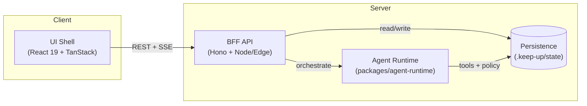
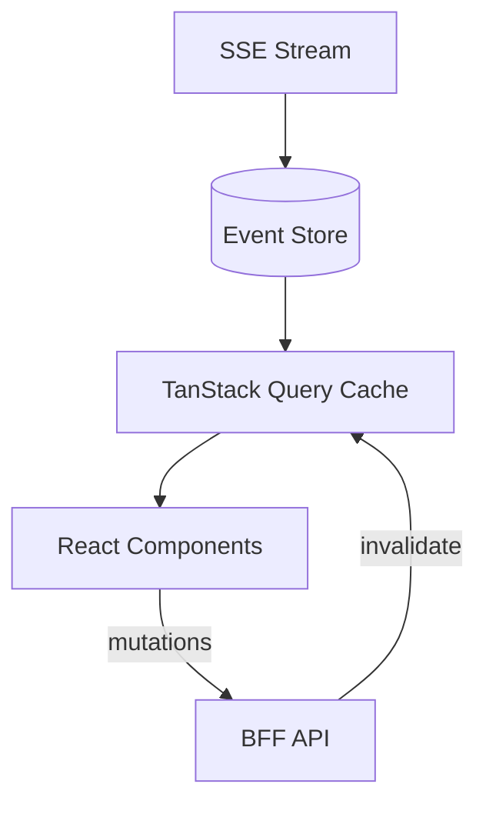

# Cowork App Architecture

> **apps/cowork** — Local-first agentic task execution with transparent approvals.

## Architecture Goals

| Goal | Rationale |
|------|--------|
| **Local-first** | UI and runtime separated; no external dependencies for core flows |
| **Deterministic** | Auditable task execution aligned to Cowork policy DSL |
| **Fast** | Resilient SSE streaming; sub-second state hydration |
| **Portable** | Modular structure for desktop packaging (Tauri-ready) |

---

## System Overview



---

## Core Components

### 1. UI Shell (`apps/cowork/src`)

| Responsibility | Implementation |
|---------------|----------------|
| Routing | TanStack Router (file-based) |
| Data fetching | TanStack Query with SSE sync |
| Artifact rendering | Card components with apply/approve actions |
| Approval UX | Modal + inline confirmation tied to TaskGraph node IDs |

### 2. BFF API (`apps/cowork/server`)

| Responsibility | Implementation |
|---------------|----------------|
| Local server | Hono on Node or Edge runtimes |
| Endpoints | Session, task, approval, artifact CRUD |
| Streaming | SSE with `Last-Event-ID` resume support |

### 3. Agent Runtime Bridge

- Delegates to **`packages/agent-runtime`** for orchestration.
- Enforces **Cowork policy DSL** confirmation gates.
- Emits **TaskGraph** events consumed by UI via SSE.

### 4. Persistence Layer

- **Primary**: `.keep-up/state` (JSON/SQLite) for sessions, tasks, approvals.
- **Optional**: `packages/db` integration for durable cross-session metadata.
- **Edge**: D1 (Cloudflare) or platform storage adapters for sessions/tasks/approvals.

## Proposed App Structure
```
apps/cowork/
  src/
    app/
      routes/
      layouts/
      providers/
    features/
      chat/
      tasks/
      artifacts/
      approvals/
      workspace/
    components/
    hooks/
    api/
    state/
    styles/
  server/
    index.ts
    routes/
    services/
  tests/
    unit/
    e2e/
```

## Routing Map (TanStack Router)
- /: landing + session list
- /sessions/:id: chat + task workspace
- /sessions/:id/artifacts: artifact gallery
- /sessions/:id/logs: task logs + timeline
- /settings: workspace, models, policy preferences

## Data Flow (Task Execution)
1. User submits task prompt.
2. UI calls BFF `/api/sessions/:id/tasks`.
3. BFF invokes `agent-runtime` with Cowork policy context.
4. TaskGraph events stream over SSE.
5. UI updates task timeline and renders artifacts.
6. Approval actions post back to `/api/approvals/:id`.

## API Surface (Initial)
- POST /api/workspaces
- GET /api/workspaces
- POST /api/sessions
- GET /api/sessions/:id
- POST /api/sessions/:id/messages
- POST /api/sessions/:id/tasks
- GET /api/sessions/:id/stream (SSE)
- POST /api/approvals/:id
- GET /api/artifacts/:id

## State Management



- **TanStack Query**: cache + invalidation for REST endpoints.
- **Event Store**: lightweight in-memory buffer for SSE TaskGraph events.
- **Derived Selectors**: UI subscribes to TaskGraph nodes with memoized selectors.

---

## Offline & Resilience

| Scenario | Mitigation |
|----------|------------|
| SSE disconnect | `Last-Event-ID` header resumes from last received event |
| Browser refresh | Persist task snapshots + approvals in `.keep-up/state` |
| Stale sessions | TTL-based cleanup (default: 7 days) |

## Testing Strategy

| Layer | Tool | Scope |
|-------|------|-------|
| Unit | Vitest (Node) | Services, hooks, utilities |
| Component | Vitest + Testing Library | UI components in isolation |
| E2E | Playwright | Smoke + cowork-specific flows only |

> [!TIP]
> Avoid full E2E suite during development; run targeted specs via `/e2e-test` workflow.

---

## Security & Safety

| Constraint | Enforcement |
|-----------|-------------|
| File access | Cowork policy DSL scopes paths per session |
| Tool execution | Confirmation gates tied to TaskGraph node IDs |
| Memory isolation | No cross-session memory in cowork mode |
| Document mutation | AI Envelope dry-run pipeline required |

---

## Risks & Mitigations

| Risk | Mitigation |
|------|------------|
| Long-running task instability | TaskGraph replay + SSE resume |
| Permission fatigue | Bundle approvals by risk tier; cache grants |
| Tool latency | Cache context; optimize startup pipelines |
