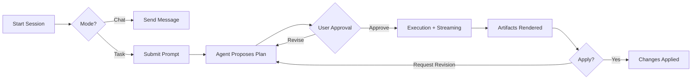

# Cowork App Product Spec

> **apps/cowork** — Chat + task-mode collaboration for agentic work.

## Summary

Build a dedicated Cowork application targeting the UX bar set by **Claude Cowork** and **Manus**. The app makes agentic work **transparent**, **safe**, and **fast** with strong task structure, approval gates, and artifact-first outputs. Runs **local-first** by default; integrates with existing `agent-runtime` and Cowork policy stack.

---

## Objectives

| # | Objective |
|---|----------|
| 1 | Best-in-class cowork UX: plan → execute → review → summarize with full visibility |
| 2 | Chat + task-mode workflows with first-class artifacts (plan, diff, checklist, report) |
| 3 | Enforce Cowork safety: scoped file access, confirmation gates, deterministic execution |
| 4 | Modern stack: TanStack Router + Query, Vitest, Node/Edge |
| 5 | Keep-Up standards: Loro-only CRDT, a11y compliance, deterministic LFCC pipelines |

---

## Non-Goals

- ❌ Replace reader or editor apps.
- ❌ Introduce non-Loro CRDTs (no Yjs).
- ❌ Build new AI gateway outside `agent-runtime`.
- ❌ Multi-tenant hosting (local-first + desktop-ready first).

## Target Users
- Individual builders running focused task-mode sessions on local repos.
- Technical leads reviewing plans, diffs, and progress artifacts.
- Teams that need reproducible, auditable agent runs.

## Experience Principles
- Transparent: show plans, actions, approvals, and artifacts before applying changes.
- Trustworthy: deterministic execution, clear permission scopes, and audit logs.
- Fast: minimal time to first task, quick context hydration, and snappy UI.
- Control-first: users can pause, resume, or cancel tasks at any time.

## Core Capabilities

| Priority | Capability |
|----------|------------|
| **P0** | Chat workspace with structured prompts, threaded context, quick actions |
| **P0** | Task mode with explicit phases: plan → execution → review → summary |
| **P0** | Approval workflow for file/system actions (risk tags + reasons) |
| **P0** | Artifact-first outputs (plan, diff, checklist, report) with apply/approve |
| **P1** | Scoped file access + connector grants via Cowork policy DSL |
| **P1** | Observability: task timeline, tool logs, cost & duration summaries |
| **P2** | Multi-agent execution with bounded concurrency + status visibility |
| **P2** | Session-local memory (no cross-session memory in cowork mode) |

## Key User Flows

### 1. Start a Session
- Select workspace folder → grant scoped access.
- Choose **Task Mode** or **Chat Mode**.

### 2. Execute a Task
- Agent proposes a **plan artifact**.
- User approves → execution streams status + logs.

### 3. Review Outputs
- Artifacts render as cards (diffs, reports, checklists).
- User can **approve**, **apply**, or **request revisions**.

## Data Model (Logical)
- Workspace: id, rootPath, grants, createdAt.
- Session: id, workspaceId, title, mode, createdAt, status.
- Message: id, sessionId, role, content, createdAt.
- Task: id, sessionId, status, summary, createdAt, updatedAt.
- ToolRun: id, taskId, toolName, status, telemetry, createdAt.
- Artifact: id, taskId, type, payload, status, createdAt.
- Approval: id, taskId, action, riskTag, status, createdAt.
- FileGrant: id, workspaceId, path, scope, createdAt.

## Tech Stack
- UI: React 19, TanStack Router, TanStack Query, TanStack Virtual.
- Styling: Tailwind v4 with shared tokens from `packages/app`.
- Runtime: Node/Edge for server execution, Bun optional for local dev speed.
- Testing: Vitest for unit/component tests; Playwright for targeted e2e.
- TypeScript-only code, no `any`, no `var`.

## Integrations
- `packages/agent-runtime`: tool orchestration, Cowork policy enforcement.
- `packages/ai-core`: prompt profiles, model routing.
- `packages/app`: shared UI primitives and design tokens.
- `packages/core`: policy evaluation and observability helpers.
- `.keep-up/state`: persisted task history and approval logs.

## Safety and Compliance
- Follow AI Envelope rules: no direct document mutation by agents.
- Enforce Cowork policy DSL for file and tool access.
- Maintain deterministic behavior for LFCC pipelines.
- Follow a11y requirements and design standards.

## Success Metrics

| Metric | Target |
|--------|--------|
| Time to first plan | < 5s (warm session) |
| Simple task completion (with approvals) | < 60s |
| Unscoped file access attempts | **0** in audit logs |
| User trust/clarity score | ≥ 4.5 / 5 baseline |

---

## Decisions & Recommendations

| Question | Recommendation | Rationale |
|----------|----------------|----------|
| Desktop packaging | **Tauri first** | Smaller bundle, Rust security sandbox, aligns with local-first |
| Multi-user collaboration | **Defer to P2** | Start single-user; add session sharing after core flows stable |
| Connector priority | **File + Shell → Git → HTTP** | Cover 90% of local dev tasks; HTTP connectors require trust model |
