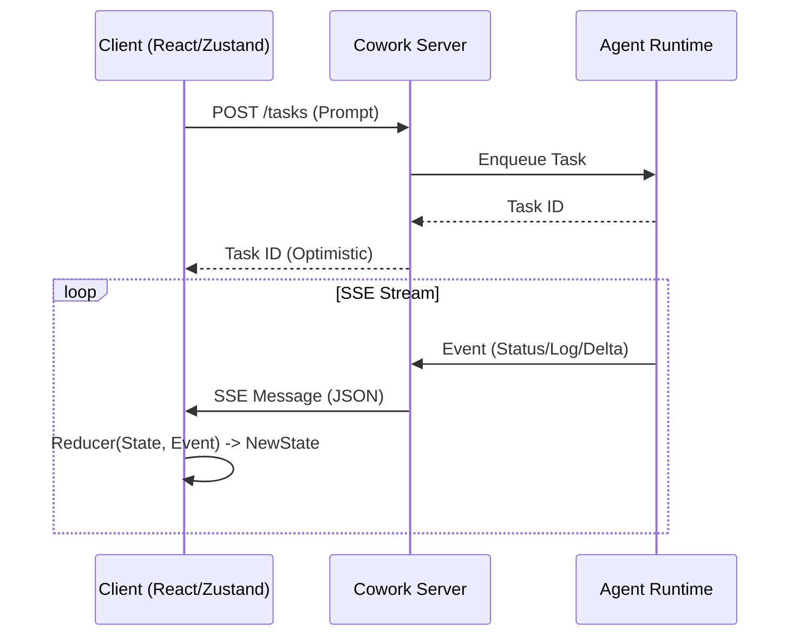

# Cowork Data Flow & State Management Spec

> **Philosophy**: Cowork uses a **Server-Authoritative, Unidirectional Data Flow**.
> The Client is a "View" of the Server's `CoworkSession` state.
> Updates are pushed via **Server-Sent Events (SSE)**.

**Related Specs:**
- [API Contracts](file:///Users/han/Documents/Code/Parallel/keep-up/docs/specs/cowork/cowork-api-contracts.md) — Endpoint definitions
- [Persistence Spec](file:///Users/han/Documents/Code/Parallel/keep-up/docs/specs/cowork/cowork-persistence-spec.md) — SQLite schema
- [Error Handling](file:///Users/han/Documents/Code/Parallel/keep-up/docs/specs/cowork/cowork-error-handling.md) — Reconnection strategies

---

## 1. High-Level Architecture



## 2. Server-Sent Events (SSE) Protocol

**Endpoint**: `GET /api/cowork/sessions/:sessionId/events`

### 2.1 Wire Format
All messages MUST follow this format:
```ts
interface ValidSSEMessage {
  id: string;      // Unique Event ID
  event: string;   // Event Type (e.g., "task.delta")
  data: string;    // JSON Stringified Payload
  retry?: number;  // Reconnection time (ms)
}
```

### 2.2 Event Types & Payloads

#### `session.snapshot` (Initial Load / Reconnect)
Sent immediately upon connection to sync full state.
```ts
interface SessionSnapshot {
  session: CoworkSession;
  tasks: CoworkTask[]; // Last N active tasks
  artifacts: ArtifactMetadata[];
}
```

#### `task.delta` (Incremental Updates)
Used for token streaming and state changes.
```ts
interface TaskDelta {
  taskId: string;
  // JSON Patch or Partial Update
  patch?: {
    status?: TaskStatus;
    plan?: Partial<TaskPlan>;
    cost?: { total: number };
  };
  // Text Append (for streaming logs/thought)
  append?: {
    field: "log" | "stream_content";
    content: string;
  };
}
```

#### `agent.thought` (Transparency)
Structured insight into the agent's loop.
```ts
interface AgentThought {
  taskId: string;
  step: number;
  thought: string; // The specific reasoning
  tools_called: string[];
}
```

---

## 3. Frontend State Management

We use **Zustand** (or equivalent) as the single source of truth.

### 3.1 Store Slice: `useCoworkStore`

```ts
interface CoworkState {
  // Data
  sessions: Record<string, CoworkSession>;
  tasks: Record<string, CoworkTask>;
  activeTaskId: string | null;
  
  // Connection Status
  isConnected: boolean;
  lastEventId: string | null;

  // Actions
  connect: (sessionId: string) => void;
  disconnect: () => void;
  dispatch: (event: CoworkEvent) => void; // The Reducer
}
```

### 3.2 The Reducer Pattern
The client MUST NOT contain complex business logic. It simply applies patches.

```ts
function eventReducer(state: CoworkState, event: CoworkEvent): CoworkState {
  switch (event.type) {
    case "task.created":
      return { ...state, tasks: { ...state.tasks, [event.taskId]: event.payload } };
    
    case "task.delta":
      const task = state.tasks[event.taskId];
      if (!task) return state;
      
      // Apply Append
      if (event.append) {
         // efficient string concatenation
      }
      
      // Apply Patch
      if (event.patch) {
         Object.assign(task, event.patch);
      }
      return { ...state, tasks: { ...state.tasks, [event.taskId]: { ...task } } };
      
    // ... handle others
  }
}
```

## 4. Latency & Optimistic UI

### 4.1 "The 100ms Rule"
To ensure the interface feels "Arc-like" (fluid), we use Optimistic Updates for:
1.  **Sending a Message**: Immediately append a "pending" user bubble.
2.  **Stopping a Task**: Immediately show "Stopping..." state before server ack.

### 4.2 Handling Desync
If the SSE connection drops:
1.  UI shows "Reconnecting..." toast (Yellow/Amber).
2.  Client automatically retries (Exponential Backoff).
3.  On Reconnect: Server sends `session.snapshot` to replace/reconcile state.
