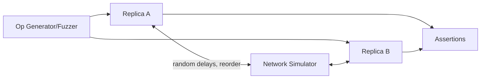

# Conformance Test Suite Plan — v0.9 RC

**Applies to:** LFCC v0.9 RC  
**Last updated:** 2025-12-31  
**Audience:** SDET, QA engineers, platform verification.  
**Source of truth:** LFCC v0.9 RC §13 (Conformance), §8 (Canonicalizer), §7 (Dirty), §9 (History), §11 (AI).

---

## 0. Goals

1. Prove **INV-DET-001** determinism and convergence under adversarial interleavings.
2. Prove **no silent drift** for annotations across structural ops and edits.
3. Prove Mode B conforms using **canonical tree equivalence** (not HTML).
4. Prove AI pipeline safety: preconditions + dry-run + deterministic apply.

## 0.1 Compliance Gates (Normative)

To claim LFCC v0.9 RC compliance, the following gates are **required**:

| Area | Required Gates | Recommended Gates |
| --- | --- | --- |
| Determinism | multi-interleaving convergence suite | extended multi-replica (>3) runs |
| BlockMapping | axioms property tests + perf target | fuzzed ops across 10k seeds |
| Canonicalizer | idempotency + determinism | semantic equivalence corpus |
| AI Safety | preconditions + dry-run reject/accept corpus | adversarial payload fuzzing |
| Dirty/Compare | dev compare (no mismatches) | injected-bug detection tests |
| History | HISTORY_RESTORE transitions | multi-user restore interleavings |

**Compliance rule:** All required gates MUST pass in CI to advertise LFCC v0.9 RC conformance.

---

## 1. Test Harness Architecture

Replicas include:
- CRDT engine
- bridge/shadow model (Mode B) or native blocks (Mode A)
- annotation layer
- canonicalizer

---

## 2. Mode B “Semantic Double-Blind” Test

### 2.1 Goal
Assert that Shadow Model and the real editor agree semantically under the same operations.

### 2.2 Procedure
1. Run operations into:
   - headless editor (Playwright) producing an editor document tree,
   - Shadow model producing a shadow structure tree.
2. Canonicalize both using LFCC canonicalizer v2.
3. Assert:
   - canonical trees are equal,
   - diagnostics only include allowed normalizations.

**Pass criteria:** CanonNode trees match (structure + ordered children + text leaves + marks + attrs).

---

## 3. Determinism & Convergence (SEC)

### 3.1 Invariant
Given the same final update set, replicas converge to identical:
- document state
- block structure/ids
- annotation stored states
- rendering keys

### 3.2 Method
- generate randomized operation sequences
- run multiple interleavings (permutation of delivery order)
- compare final canonical outputs + metadata

---

## 4. Fuzzing Strategy

### 4.1 Operation Pool
Include:
- typing bursts (text edit)
- mark toggles
- splits/joins
- list reparent
- table struct ops
- reorder blocks
- large paste
- undo/redo restore
- AI replace spans (simulated)

### 4.2 Generators
- structure-aware generators that produce nested tables/lists
- random selection ranges including跨段落 spans

### 4.3 Seeds
- deterministic seeds (commit-based + test index)
- store failing seeds as golden fixtures

---

## 5. Dirty Region Verification

### 5.1 DEV-mode Compare
For each transaction:
- compute dirty-region affected spans
- compute full scan spans (or adaptive-with-coverage)
- diff must be empty; otherwise fail.

### 5.2 Targeted “missed neighbor” test
Intentionally inject a bug (skip neighbor expansion) and assert harness detects mismatch.

---

## 6. History Integration Tests

- Undo/Redo restores:
  - annotations revive same UUIDs
  - display enters active_unverified
  - skip grace
  - triggers verify checkpoint
- Interleavings with remote edits:
  - restore becomes orphan or partial deterministically

---

## 7. AI Safety Tests

### 7.1 Preconditions
- mismatch hash → 409
- missing span → 409
- unverified span → 409

### 7.2 Dry-run
- disallowed tags removed/rejected
- schema invalid payload rejected
- success returns canonical tree

### 7.3 Deterministic apply
- same payload → same canonical doc state

---

### 7.4 AI-native Extension (Optional)
Run only when AI-native is negotiated:
- idempotency: duplicate `request_id` does not double-apply
- agent auth: invalid or expired agent token rejected
- data access: redaction policy enforced before model call
- audit: accepted and rejected requests emit audit records
- policy validation: `auto_merge_threshold` within 0..1, `ai_autonomy=full` requires audit retention

## 8. Property-Based Testing Requirements

### 8.1 Framework Requirements
- Use property-based testing framework (fast-check, jsverify, or equivalent)
- Generate arbitrary operations, documents, and annotations
- Verify axioms hold for all generated inputs

### 8.2 Properties to Test

**BlockMapping Axioms:**
- Determinism: Same operation → same mapping
- Monotonicity: posA < posB → mapped(posA) ≤ mapped(posB)
- Locality: Mapped positions are near original positions
- Coverage: All positions have mappings for KEEP-ID edits

**Canonicalization Properties:**
- Idempotency: canonicalize(canonicalize(doc)) == canonicalize(doc)
- Determinism: Same document → same canonical form
- Equivalence: Semantically equivalent documents → same canonical form

**Annotation Properties:**
- No silent drift: Annotations don't move to unrelated content
- Determinism: Same operations → same annotation states
- Chain policy compliance: All annotations satisfy chain policy

### 8.3 Coverage Requirements

**Minimum Coverage Thresholds:**
- BlockMapping axioms: 100% of operation types
- Canonicalization: 95% of block types and mark combinations
- Annotation reconciliation: 90% of structural operation scenarios
- AI safety: 100% of sanitization rules

**Edge Case Coverage:**
- Empty documents
- Single-character documents
- Zero-length spans
- Maximum document sizes
- Deep nesting (up to limits)

---

## 9. Integration Test Scenarios

### 9.1 Full Workflow Tests

**Scenario 1: Collaborative Editing**
1. Two users edit same document
2. Create annotations
3. Apply structural operations
4. Verify convergence and annotation integrity

**Scenario 2: AI Integration**
1. Create annotation
2. Request AI modification
3. Apply AI payload
4. Verify annotation integrity

**Scenario 3: History and Collaboration**
1. User A edits document
2. User B edits same region
3. User A undos
4. Verify state consistency

---

## 10. Exit Criteria (Release)

- 0 critical determinism failures across 10k fuzz cases
- 0 silent-drift findings in annotation reconcile suite
- Mode B semantic double-blind stable across browsers used in CI
- AI dry-run suite passes with malicious payload corpus
- Property-based tests pass for all axioms (1000+ generated cases each)
- Minimum coverage thresholds met (see §8.3)
- All integration scenarios pass
