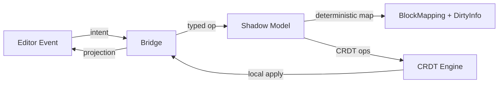
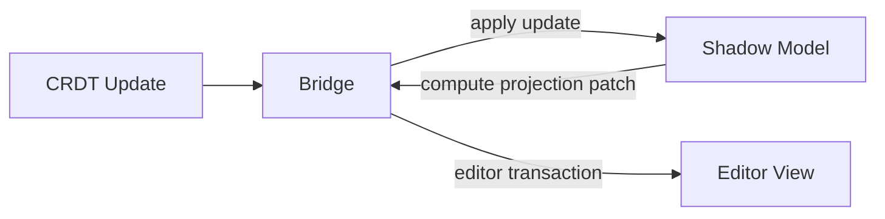

\
# Shadow Model & Bridge Architecture (Mode B) — v0.9 RC

**Applies to:** LFCC v0.9 RC  
**Last updated:** 2025-12-31  
**Audience:** Editor engineers, bridge maintainers, platform architects.  
**Source of truth:** LFCC v0.9 RC §3 (Blocks), §4 (Op taxonomy), §7 (DirtyInfo), §8 (Canonicalizer), §12 (Degradation), §13 (Conformance).

---

## 0. Purpose

Mode B is for editors whose native model is not CRDT-native. To remain LFCC-conformant, Mode B must introduce a **Shadow Structure Model** that is:
- deterministic across platforms/browsers,
- the source for block boundaries and block identity decisions,
- capable of emitting CRDT ops and projecting CRDT updates back into the editor view.

---

## 1. Components

### 1.1 Editor (View)
- DOM / editor schema tree
- emits user intents (typing, split, join, list reparent, table struct, reorder)

### 1.2 Shadow Model (Deterministic Kernel)
- platform-independent structure tree (blocks/containers)
- stable block_id allocation rules
- canonicalizer compatible representation for conformance tests

### 1.3 Bridge
- translates Editor events → Shadow ops → CRDT ops
- translates CRDT updates → Shadow apply → Editor projection
- produces **DirtyInfo** and **BlockMapping**

### 1.4 CRDT Engine
- Loro/Yjs or equivalent; provides update DAG/log
- holds authoritative text/structure in Mode A; in Mode B may be “state store” fed by Shadow

---

## 2. Data Flow

### 2.1 Forward Flow (User input)

Key rules:
- **The editor event is NOT authoritative**. The bridge must translate it into a typed operation with op codes (§4).
- Shadow model applies typed ops, determines KEEP/REPLACE IDs, and emits CRDT edits.
- Bridge provides DirtyInfo for annotation reconcile.

### 2.2 Reverse Flow (Remote updates)

Key rules:
- Apply remote updates first to Shadow (deterministic), then project to Editor.
- Never let Editor “invent structure” outside Shadow.

---

## 3. Typed Operations (Op Taxonomy)

Bridge MUST classify each transaction into one or more op codes:
- `OP_TEXT_EDIT`, `OP_MARK_EDIT`
- `OP_BLOCK_SPLIT`, `OP_BLOCK_JOIN`, `OP_BLOCK_CONVERT`
- `OP_LIST_REPARENT`
- `OP_TABLE_STRUCT`
- `OP_REORDER`
- `OP_PASTE`
- `OP_IMMUTABLE_REWRITE`

### 3.1 Editor → Typed Ops

Editor events are normalized into typed ops, for example:

- Enter key in paragraph:
  - `OP_BLOCK_SPLIT` with `{ block_id, splitOffset }`
- Backspace at start of block:
  - `OP_BLOCK_JOIN` with `{ leftBlockId, rightBlockId }`
- Drag list item:
  - `OP_LIST_REPARENT` with `{ itemId, newParentId, newIndex }`
- Table merge cells:
  - `OP_TABLE_STRUCT` with `{ tableId, action: "merge_cells", ... }`

---

## 4. Block Boundaries, IDs, and Projection

### 4.1 Block IDs
- Shadow owns `block_id` assignment and retirement.
- Rules must match LFCC v0.9 RC §4 (KEEP/REPLACE).

### 4.2 Projection Strategy
Prefer “patch projection”:
- compute minimal editor transaction (insert/remove nodes, update marks)
- avoid re-rendering full document to preserve selection/IME stability

### 4.3 BlockMapping Production
Shadow must produce mapping from old blocks to new blocks for each typed op:
- splits map old → left (keep id), plus new right id
- joins map right offsets to left id
- reparent may preserve ids, but changes parent pointers deterministically

---

## 5. Mode B Conformance (“Semantic Double-Blind”)

Mode B MUST pass canonical equivalence checks using the v0.9 canonicalizer:
- compare CanonNode trees (structure + ordered children + text leaves/marks)
- do NOT compare raw HTML

Recommended harness:
- Playwright headless editor renders the real editor tree
- Shadow model produces canonical tree from its own structure
- Both canonicalized via **the same lfcc-kernel canonicalizer**

---

## 6. Failure and Degradation

If Mode B cannot guarantee determinism for a feature (e.g., complex tables):
- negotiate capability off (`tables=false`), or
- degrade to read-only for that structure, or
- refuse co-edit only if correctness-critical mismatch occurs.

---

## 7. Reference Implementation Checklist

- [ ] Shadow structure tree supports nested containers (list/table/quote)
- [ ] All editor actions mapped to typed ops with op codes
- [ ] Deterministic block id rules implemented and tested
- [ ] BlockMapping axioms satisfied
- [ ] DirtyInfo provided per transaction
- [ ] Canonicalizer equivalence passes across platforms
- [ ] Reverse projection deterministic and stable for IME/selection

