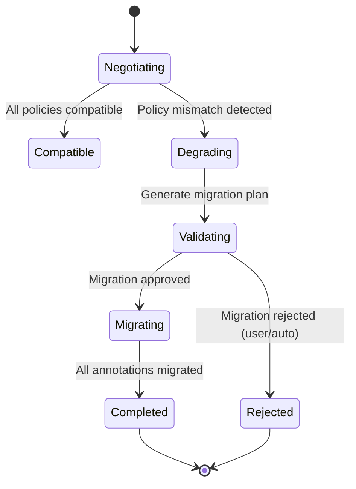

# Chain Policy Degradation Guide — v0.9 RC

**Applies to:** LFCC v0.9 RC  
**Last updated:** 2025-01-01  
**Audience:** Collaboration platform engineers, frontend engineers, UX designers.  
**Source of truth:** LFCC v0.9 RC §6.1.1 (Chain Policy Degradation), §12 (Compatibility Degradation)

---

## 0. Purpose

This guide specifies how to handle chain policy degradation when negotiation results in more restrictive policies, ensuring deterministic annotation migration and clear user communication.

---

## 1. Chain Policy Types and Restrictions

### 1.1 Policy Hierarchy (Most to Least Restrictive)

1. **strict_adjacency** (most restrictive)
   - Blocks must be adjacent with no intervening content blocks
   - Gaps: 0

2. **bounded_gap(max_intervening_blocks=N)**
   - Blocks must maintain relative order
   - Limited intervening blocks allowed (N ≥ 0)
   - Gaps: 0 to N

3. **required_order** (least restrictive)
   - Blocks must maintain relative order
   - No limit on intervening blocks
   - Gaps: any

### 1.2 Degradation Paths

```
required_order
    ↓
bounded_gap(max=N)
    ↓
strict_adjacency
```

Any degradation moves down this hierarchy (more restrictive).

---

## 2. Degradation State Machine

### 2.1 State Transitions



### 2.2 Degradation Scenarios

#### Scenario 1: bounded_gap(max=N) → strict_adjacency

**Trigger:** Negotiation results in `bounded_gap=false` or participant doesn't support bounded_gap.

**Migration Steps:**
1. Identify all annotations using `bounded_gap` policy
2. For each annotation:
   - Count intervening blocks between chain blocks
   - If gaps > 0:
     - Check `partial_policy` for annotation kind:
       - If `allow_drop_tail` or `allow_islands`: transition to `active_partial`
       - Otherwise: transition to `orphan`
   - If gaps = 0: no change (already satisfies strict_adjacency)
3. Re-verify all affected annotations at next checkpoint
4. Update stored state

**Example:**
```typescript
interface DegradationResult {
  affectedAnnotations: string[];
  migrationPlan: {
    annotationId: string;
    oldState: "active";
    newState: "active_partial" | "orphan";
    reason: string;
  }[];
}

function degradeBoundedGapToStrict(
  annotations: Annotation[],
  effectivePolicy: ChainPolicy
): DegradationResult {
  const affected: DegradationResult = {
    affectedAnnotations: [],
    migrationPlan: []
  };
  
  for (const anno of annotations) {
    if (anno.target.chain.policy.kind === "bounded_gap") {
      const gaps = countInterveningBlocks(anno);
      if (gaps > 0) {
        affected.affectedAnnotations.push(anno.id);
        const partialPolicy = getPartialPolicy(anno.kind);
        const newState = partialPolicy === "allow_drop_tail" || 
                        partialPolicy === "allow_islands"
          ? "active_partial"
          : "orphan";
        
        affected.migrationPlan.push({
          annotationId: anno.id,
          oldState: anno.status.state,
          newState,
          reason: `Gap count (${gaps}) exceeds strict_adjacency limit (0)`
        });
      }
    }
  }
  
  return affected;
}
```

#### Scenario 2: required_order → strict_adjacency

**Trigger:** Negotiation results in participant not supporting `required_order`.

**Migration Steps:**
1. Identify all annotations using `required_order` or `bounded_gap`
2. For each annotation:
   - Verify strict adjacency (no intervening blocks)
   - If not adjacent:
     - Check `partial_policy`: transition to `active_partial` or `orphan`
   - If adjacent: no change
3. Re-verify all multi-block annotations
4. Update stored state

**Example:**
```typescript
function degradeRequiredOrderToStrict(
  annotations: Annotation[],
  effectivePolicy: ChainPolicy
): DegradationResult {
  const affected: DegradationResult = {
    affectedAnnotations: [],
    migrationPlan: []
  };
  
  for (const anno of annotations) {
    if (anno.target.chain.policy.kind === "required_order" || 
        anno.target.chain.policy.kind === "bounded_gap") {
      const isAdjacent = verifyStrictAdjacency(anno);
      if (!isAdjacent) {
        affected.affectedAnnotations.push(anno.id);
        const partialPolicy = getPartialPolicy(anno.kind);
        const newState = partialPolicy === "allow_drop_tail" || 
                        partialPolicy === "allow_islands"
          ? "active_partial"
          : "orphan";
        
        affected.migrationPlan.push({
          annotationId: anno.id,
          oldState: anno.status.state,
          newState,
          reason: "Annotation violates strict_adjacency requirement"
        });
      }
    }
  }
  
  return affected;
}
```

#### Scenario 3: required_order → bounded_gap(max=N)

**Trigger:** Negotiation results in lower `max_intervening_blocks` value.

**Migration Steps:**
1. Identify annotations with gaps > new max
2. For each affected annotation:
   - If gaps > new max: transition to `active_partial` or `orphan`
   - Otherwise: update policy, keep state
3. Re-verify at checkpoint

---

## 3. Negotiation-Time Validation

### 3.1 Pre-Acceptance Checks

Before accepting an effective manifest that degrades chain policies:

```typescript
interface NegotiationValidation {
  canAccept: boolean;
  migrationPlan: DegradationResult;
  warnings: string[];
  requiresConfirmation: boolean;
}

function validateDegradation(
  currentManifest: PolicyManifest,
  effectiveManifest: PolicyManifest,
  existingAnnotations: Annotation[]
): NegotiationValidation {
  const migrationPlan = computeMigrationPlan(
    currentManifest,
    effectiveManifest,
    existingAnnotations
  );
  
  const affectedCount = migrationPlan.affectedAnnotations.length;
  const totalCount = existingAnnotations.length;
  const affectedRatio = totalCount > 0 ? affectedCount / totalCount : 0;
  
  const requiresConfirmation = 
    affectedRatio > 0.1 || // More than 10% affected
    affectedCount > 50;     // Or more than 50 annotations
  
  return {
    canAccept: true, // Can always accept, but may need confirmation
    migrationPlan,
    warnings: generateWarnings(migrationPlan),
    requiresConfirmation
  };
}
```

### 3.2 User Notification Requirements

**When to Notify:**
- Any degradation occurs (informational)
- >10% of annotations affected (warning)
- >50 annotations affected (warning)
- User confirmation required (blocking)

**Notification Content:**
```typescript
interface DegradationNotification {
  title: string;
  message: string;
  affectedCount: number;
  examples: {
    annotationId: string;
    kind: string;
    oldState: string;
    newState: string;
  }[];
  actions: {
    accept: () => void;
    reject: () => void;
    review: () => void; // Show detailed list
  };
}
```

**Example Messages:**
- "Capability reduced: Some annotations may be affected"
- "15 annotations will become partial or orphaned due to capability reduction"
- "Review affected annotations before continuing"

---

## 4. Migration Procedures

### 4.1 Automatic Migration

**When:** Degradation is accepted and migration plan is approved.

**Steps:**
1. Apply migration plan atomically
2. Update annotation stored states
3. Trigger verification checkpoint
4. Log migration events
5. Notify UI of state changes

```typescript
async function applyMigration(
  migrationPlan: DegradationResult
): Promise<void> {
  // Atomic batch update
  const updates = migrationPlan.migrationPlan.map(plan => ({
    annotationId: plan.annotationId,
    update: {
      status: {
        state: plan.newState,
        reason: plan.reason
      }
    }
  }));
  
  await batchUpdateAnnotations(updates);
  
  // Trigger verification
  await triggerCheckpoint({
    priority: "high",
    reason: "post_degradation_verification"
  });
  
  // Log migration
  logger.info("chain_policy_degradation", {
    affectedCount: migrationPlan.affectedAnnotations.length,
    migrationPlan: migrationPlan.migrationPlan
  });
}
```

### 4.2 Rollback (if supported)

If degradation is rejected or user cancels:

```typescript
function rollbackDegradation(
  originalManifest: PolicyManifest
): void {
  // Revert to original manifest
  setEffectiveManifest(originalManifest);
  
  // Restore original annotation states (if cached)
  restoreAnnotationStates();
  
  // Notify user
  notifyUser("Degradation cancelled. Original capabilities restored.");
}
```

---

## 5. User Experience Guidelines

### 5.1 Visual Indicators

**During Negotiation:**
- Show "Negotiating capabilities..." indicator
- Display pending changes if known

**After Degradation:**
- Update annotation visual states immediately
- Show tooltips explaining state changes
- Provide "Review affected annotations" action

**For Partial/Orphaned Annotations:**
- Use visual distinction (dashed lines, different colors)
- Show explanation in tooltip/panel
- Provide "Retry verification" action if applicable

### 5.2 Error Messages

**Clear and Actionable:**
- "15 annotations affected by capability reduction"
- "Some annotations became partial due to stricter policy requirements"
- "Click to review affected annotations"

**Avoid:**
- Technical jargon ("bounded_gap degraded to strict_adjacency")
- Vague messages ("Some annotations may be affected")

---

## 6. Implementation Checklist

- [ ] Implement degradation detection in negotiation
- [ ] Implement migration plan generation
- [ ] Add user notification system
- [ ] Implement automatic migration
- [ ] Add rollback support (if required)
- [ ] Implement verification checkpoint trigger
- [ ] Add logging and diagnostics
- [ ] Create UI components for notifications
- [ ] Add tests for each degradation scenario
- [ ] Document user-facing messages

---

## 7. Test Cases

### 7.1 Unit Tests

```typescript
describe("Chain Policy Degradation", () => {
  test("bounded_gap to strict_adjacency with gaps", () => {
    const annotations = createAnnotationsWithGaps();
    const result = degradeBoundedGapToStrict(annotations, strictPolicy);
    expect(result.affectedAnnotations.length).toBeGreaterThan(0);
    expect(result.migrationPlan[0].newState).toBe("active_partial");
  });
  
  test("required_order to strict_adjacency", () => {
    const annotations = createAnnotationsWithOrder();
    const result = degradeRequiredOrderToStrict(annotations, strictPolicy);
    // Verify all non-adjacent annotations are affected
  });
  
  test("migration plan generation", () => {
    const plan = computeMigrationPlan(current, effective, annotations);
    expect(plan.affectedAnnotations).toBeDefined();
    expect(plan.migrationPlan).toBeDefined();
  });
});
```

### 7.2 Integration Tests

```typescript
describe("Degradation Integration", () => {
  test("full degradation workflow", async () => {
    // Setup: Create annotations with bounded_gap
    // Action: Negotiate with strict_adjacency only
    // Verify: Annotations migrated, states updated, checkpoint triggered
  });
  
  test("user rejection of degradation", async () => {
    // Setup: Degradation requires confirmation
    // Action: User rejects
    // Verify: Rollback, original state preserved
  });
});
```

---

## 8. References

- **LFCC Protocol:** §6.1.1 Chain Policy Degradation
- **LFCC Protocol:** §12 Compatibility Degradation
- **LFCC Protocol:** §9 Annotation Display State Machine

---

**Document Version:** 1.0  
**Last Updated:** 2025-01-01

