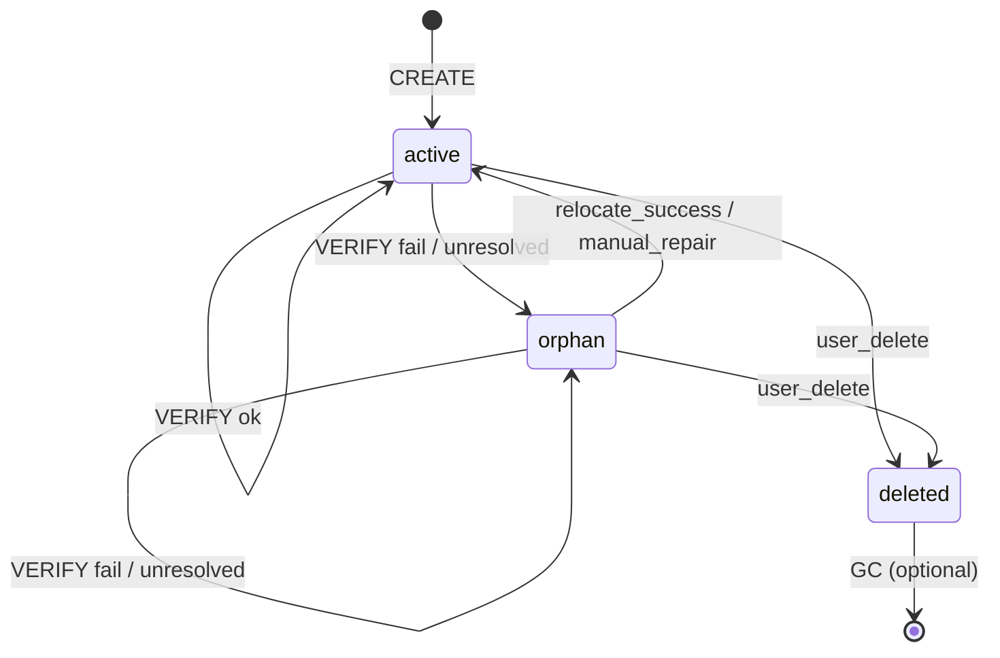

# LFCC v0.9.3 - Reference Store Backend Specification

**Status:** Draft  
**Author:** Keep-Up Team  
**Created:** 2026-01-18  
**Target Version:** LFCC v0.9.3  
**Prerequisite:** LFCC v0.9.2 (Multi-Document Support)

**Goal:** Standardize the physical reference store backend for cross-document references, ensuring SEC convergence and cross-device sync.

---

## 0. Scope

This specification addresses the item deferred from v0.9.2 §11:

> "Standardize the physical reference store backend (e.g., a dedicated Loro 'workspace graph' document) beyond the logical record contract in §5.3."

---

## 1. Normative Requirements

### 1.1 Core Guarantees (MUST)

- **RS-001:** The reference store MUST converge under Strong Eventual Consistency (SEC).
- **RS-002:** The reference store MUST be scoped to a single policy domain (`policy_domain_id = policy_manifest.policy_id`).
- **RS-003:** Each stored reference MUST include a `record` field that conforms to the `CrossDocReferenceRecord` logical shape defined in v0.9.2 §5.3.
- **RS-004:** Reference IDs (`ref_id`) MUST be globally unique within the policy domain.
- **RS-005:** Reference updates MUST use deterministic conflict resolution as specified in v0.9.2 MD-066.

### 1.2 Loro Workspace Graph Document (Normative)

The reference store MUST be implemented as a dedicated Loro document (the "workspace graph").

**RS-010:** The workspace graph document MUST have the following logical root shape (JSON shown for clarity):

```json
{
  "lfcc_ref_store_ver": "1.0",
  "policy_domain_id": "policy_id",
  "references": {
    "<ref_id>": {
      "record": {
        "ref_id": "ref_uuid",
        "ref_type": "citation|continuation|related|derived|bidirectional",
        "source": {
          "doc_id": "uuid",
          "block_id": "uuid",
          "start": { "anchor": "B64(...)", "bias": "right" },
          "end": { "anchor": "B64(...)", "bias": "left" },
          "if_match_context_hash": "sha256_hex|null"
        },
        "target": {
          "doc_id": "uuid",
          "block_id": "uuid",
          "anchor": { "anchor": "B64(...)", "bias": "right" }
        },
        "created_at_ms": 1234567890,
        "created_by": { "agent_id": "uuid", "request_id": "uuid" },
        "verified_at_ms": 1234567890,
        "v": 1
      },
      "meta": {
        "status": "active|orphan|deleted",
        "updated_at_ms": 1234567890,
        "updated_by": { "agent_id": "uuid", "request_id": "uuid" },
        "deleted_at_ms": 1234567890
      },
      "audit": [
        {
          "event": "create|update|delete|verify|relocate",
          "at_ms": 1234567890,
          "by": { "agent_id": "uuid", "request_id": "uuid" },
          "from_status": "active|orphan|deleted|null",
          "to_status": "active|orphan|deleted",
          "reason": "string"
        }
      ]
    }
  },
  "indexes": {
    "by_source_doc": { "<doc_id>": { "<ref_id>": true } },
    "by_target_doc": { "<doc_id>": { "<ref_id>": true } }
  }
}
```

Notes:
- `references[ref_id].record` MUST conform to the v0.9.2 `CrossDocReferenceRecord` logical shape.
- `references[ref_id].meta` is store-local state and MUST NOT be interpreted as modifying the meaning of `record` (it is used for lifecycle UX and audit only).

**RS-011:** The `references` container MUST be a `LoroMap<ref_id, entry>`. Implementations MUST ensure lifecycle updates are deterministic:
- `meta.status` MUST use deterministic Last-Writer-Wins semantics.
- `audit` MUST be append-only (no in-place mutation), so concurrent audit events are not lost.

**RS-012:** The `indexes` are optional denormalized caches for query performance.
- If present, indexes MUST be treated as non-authoritative and MUST be rebuildable deterministically from `references`.
- Implementations MAY omit indexes entirely and compute query results by scanning `references`.

**RS-013:** The workspace graph document id (`doc_id`) MUST be deterministic within the policy domain (recommended: `lfcc_ref_store::<policy_domain_id>`), so replicas can discover and sync the same reference store document without out-of-band coordination.

### 1.3 Reference Lifecycle Operations (Normative)

#### CREATE

**RS-020:** Create MUST:
1. Be idempotent for the same `(ref_id, record.created_by.request_id)` pair (replay MUST NOT create duplicates).
2. Reject if `ref_id` already exists with a different `record.created_by.request_id`.
3. Validate all anchors resolve against the requested document frontiers (v0.9.2 MD-060).
4. If `record.source.if_match_context_hash` is present, validate it against the canonicalized text slice (v0.9.2 MD-061).
5. Insert `record`, set `meta.status = "active"`, append an `audit` event, and (if enabled) update indexes in the same Loro transaction.

#### UPDATE

**RS-021:** Update is only permitted for:
- `status` transitions (`active` ↔ `orphan` ↔ `deleted`)
- `verified_at_ms` refresh
- Anchor relocation (requires user confirmation per v0.9.2 MD-064)

**RS-022:** Update MUST:
- Preserve `record.created_by` and `record.created_at_ms` (creation provenance is immutable).
- Set `meta.updated_by`, `meta.updated_at_ms`, and append an `audit` event describing the transition.

#### DELETE (Soft)

**RS-023:** Delete MUST set `meta.status = "deleted"` rather than removing the record.

**RS-024:** Deleted records MAY be garbage-collected after `retention_period_ms` (policy-controlled, default 30 days), but retention MUST be >= the idempotency window used by the AI gateway (v0.9.2 MD-043-A recommends >= 7 days).

#### VERIFY

**RS-025:** Verify MUST:
1. Resolve all anchors against current document states
2. If source has `if_match_context_hash`, recompute and compare
3. If verification fails, transition to `meta.status = "orphan"`
4. Update `verified_at_ms` on success

### 1.4 Sync Protocol (Normative)

**RS-030:** The workspace graph document MUST sync using standard Loro update/snapshot exchange.

**RS-031:** Sync participants MUST be within the same policy domain.

**RS-032:** The workspace graph document MUST use the same CRDT frontier format and ordering rules as LFCC documents:
- Frontier format: Loro OpId strings (`peer:counter`) (LFCC v0.9 RC §2.4, §11.1).
- Frontier ordering: deterministic by peer id, then counter (LFCC v0.9 RC §11.1).

---

## 2. Reference Status State Machine (Normative)



**RS-040:** State transitions MUST be logged for audit by appending to `references[ref_id].audit` (no in-place mutation).

---

## 3. Query Interface (Normative)

Implementations MUST provide:

```typescript
type DocFrontier = { loro_frontier: string[] };

type ReferenceStatus = "active" | "orphan" | "deleted";

type ReferenceEntry = {
  record: CrossDocReferenceRecord;
  status: ReferenceStatus;
};

interface ReferenceStore {
  // Write operations
  createReference(record: CrossDocReferenceRecord): Promise<void>;
  updateReferenceStatus(refId: string, status: ReferenceStatus, reason: string): Promise<void>;
  refreshVerification(refId: string): Promise<boolean>;
  
  // Read operations
  getReference(refId: string): ReferenceEntry | undefined;
  getReferencesFromDoc(docId: string): ReferenceEntry[];
  getReferencesToDoc(docId: string): ReferenceEntry[];
  
  // Sync
  exportUpdates(since?: DocFrontier): Uint8Array;
  importUpdates(updates: Uint8Array): void;
  getFrontier(): DocFrontier;
}
```

---

## 4. Error Codes (Appendix C Extension)

Add to LFCC Appendix C:

| Code | HTTP | Phase | Retryable | Description |
|------|------|-------|-----------|-------------|
| `REF_STORE_NOT_CONFIGURED` | 503 | storage | true | Reference store not initialized |
| `REF_ANCHOR_UNRESOLVED` | 422 | storage | false | Anchor does not resolve |
| `REF_CONTEXT_HASH_MISMATCH` | 422 | storage | true | Context hash verification failed (maps to `AI_PRECONDITION_FAILED` when surfaced via AI Gateway) |
| `REF_ALREADY_EXISTS` | 400 | storage | false | Duplicate ref_id |
| `REF_NOT_FOUND` | 404 | storage | false | Reference does not exist |

---

## 5. Migration from In-Memory Store

For implementations currently using `InMemoryCrossDocumentCoordinator`:

1. Export all references as JSON
2. Initialize Loro workspace graph document
3. Import references with `meta.status = "active"`
4. Wire `ReferenceStore` interface to Loro backend
5. Deprecate in-memory coordinator for production use

---

## 6. Conformance Tests (Required)

Add to conformance suite:

1. **SEC Convergence:** Two replicas apply same reference creates → identical state
2. **Conflict Resolution:** Concurrent updates converge deterministically and do not corrupt the record shape
3. **Lifecycle Transitions:** All state machine paths tested
4. **Index Consistency (if enabled):** After any operation, indexes match reference records
5. **Sync Round-Trip:** Export → import → state equality
6. **Anchor Verification:** Orphan transition on unresolved anchor

---

## 7. Deferred to v0.9.4+

- Range targets for cross-document references
- Reference grouping (collections/folders)
- Reference permissions (ACL per reference)
