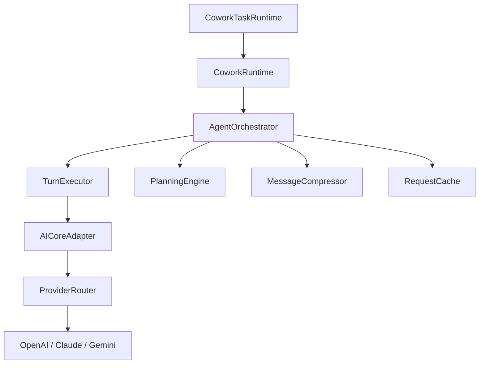

# LLM Orchestration Architecture Optimization Specification

| Field          | Value                                                                 |
| -------------- | --------------------------------------------------------------------- |
| Author         | Cowork Engineering                                                    |
| Date           | 2026-01-16                                                            |
| Status         | Draft                                                                 |
| Version        | 1.0                                                                   |

---

## 1. Introduction

### 1.1 Purpose

This specification details a comprehensive set of optimizations for the Cowork LLM Orchestration architecture. It synthesizes findings from:
1.  **Internal Analysis**: A deep-dive into the current `AgentOrchestrator`, `TurnExecutor`, and `CoworkTaskRuntime` components.
2.  **External Research**: An architectural review of the open-source [Eigent project](https://github.com/eigent-ai/eigent), which demonstrates production-grade patterns for multi-agent orchestration.

### 1.2 Scope

This document covers:
-   Context Management & Compression
-   Streaming Architecture & Backpressure
-   Tool Execution & Scheduling
-   Provider Routing
-   Agent State Management

> [!IMPORTANT]
> Implementations should follow the priority order (P0 → P3) to maximize value while minimizing risk.

---

## 2. Current Architecture Overview



| Component             | Path                                             | Responsibility                        |
| --------------------- | ------------------------------------------------ | ------------------------------------- |
| `AgentOrchestrator`   | `orchestrator/orchestrator.ts`                   | Core agent loop management            |
| `TurnExecutor`        | `orchestrator/turnExecutor.ts`                   | Single-turn execution                 |
| `MessageCompressor`   | `orchestrator/messageCompression.ts`             | Context window management             |
| `AICoreProviderAdapter` | `orchestrator/aiCoreAdapter.ts`                | LLM provider abstraction              |
| `CoworkTaskRuntime`   | `apps/cowork/server/runtime/coworkTaskRuntime.ts`| Application-layer runtime             |

---

## 3. Identified Issues & Proposed Solutions

### 3.1 Context Management (Priority: P0)

#### 3.1.1 Problem Statement

-   **Coarse Token Estimation**: The current `estimateTokens` function (`text.length / 4`) is inaccurate for structured data like JSON tool results.
-   **Naive Compression Strategy**: Does not consider semantic importance; may drop critical information in long conversations.
-   **Tool Result Bloat**: Large tool results consume disproportionate context without intelligent summarization.

#### 3.1.2 Proposed Solution: Semantic-Aware Compression

Introduce `SmartMessageCompressor` with the following capabilities:

```typescript
export interface SmartCompressionConfig extends CompressionConfig {
  /** Max tokens for any single tool result before triggering summarization */
  maxToolResultTokens: number;
  /** Enable semantic chunking based on topic changes */
  semanticChunking: boolean;
  /** Decay factor for message importance based on recency (0-1) */
  recencyDecayFactor: number;
}

export class SmartMessageCompressor extends MessageCompressor {
  /**
   * Intelligently compress tool results:
   * 1. Extract key fields from structured data
   * 2. Convert large JSON payloads to natural language summaries
   * 3. Preserve error states and critical status indicators
   */
  compressToolResult(result: MCPToolResult): MCPToolResult;
}
```

#### 3.1.3 Dynamic Context Budgeting

```typescript
export interface DynamicContextConfig {
  baseTokenBudget: number;
  toolCallReserve: number;    // Reserved for tool call overhead
  responseReserve: number;     // Reserved for model response
  taskTypeMultipliers: Record<TaskType, number>;
}

export function calculateContextBudget(
  config: DynamicContextConfig,
  modelContextWindow: number,
  taskType: TaskType
): number;
```

---

### 3.2 Streaming Architecture (Priority: P0-P1)

#### 3.2.1 Problem Statement

-   `runStream()` uses `Promise.race` without backpressure, risking event loss and memory bloat.
-   `waitForApprovalDecision()` uses busy-polling with 200ms intervals, wasting CPU cycles.

#### 3.2.2 Proposed Solution: Backpressure-Aware Event Stream

```typescript
export class BackpressureEventStream<T> {
  private readonly maxBufferSize: number;
  private readonly highWaterMark: number;
  private isPaused = false;

  push(event: T): boolean;  // Returns false when buffer is saturated
  async *consume(): AsyncGenerator<T>;  // Consumer-side async iterator
}
```

**Key Design Points**:
-   `highWaterMark`: Threshold to signal producer to slow down
-   `lowWaterMark`: Threshold to signal producer can resume
-   Oldest events are dropped when buffer overflows (configurable)

#### 3.2.3 Non-Blocking Approval Service

Replace busy-polling with event-driven design:

```typescript
export class ApprovalService {
  private readonly pendingApprovals = new Map<string, {
    resolve: (decision: 'approved' | 'rejected') => void;
    reject: (error: Error) => void;
    timeoutId?: NodeJS.Timeout;
  }>();

  async waitForDecision(approvalId: string, timeoutMs?: number): Promise<'approved' | 'rejected'>;
  resolveApproval(approvalId: string, decision: 'approved' | 'rejected'): boolean;
}
```

---

### 3.3 Tool Execution Optimization (Priority: P1-P2)

#### 3.3.1 Problem Statement

-   Parallel execution strategy is conservative; does not consider tool execution cost profiles.
-   Tool result caching is absent; identical calls may execute repeatedly.
-   Slow tools block fast tools in the same batch.

#### 3.3.2 Proposed Solution: Smart Tool Scheduler

```typescript
export interface ToolExecutionProfile {
  name: string;
  avgDurationMs: number;
  cpuIntensive: boolean;
  networkBound: boolean;
  canParallelize: boolean;
}

export class SmartToolScheduler {
  private readonly profiles = new Map<string, ToolExecutionProfile>();

  async schedule(calls: MCPToolCall[]): Promise<MCPToolCall[][]>;
  recordExecution(toolName: string, durationMs: number): void;  // Updates EMA
}
```

**Scheduling Algorithm**:
1.  Group by dependency analysis (existing `DependencyAnalyzer`)
2.  Sort within groups by execution cost (fast tools first)
3.  Respect resource limits: `maxCpuConcurrent = 2`, `maxNetworkConcurrent = 10`

#### 3.3.3 Tool Result Cache

```typescript
export interface ToolResultCacheConfig {
  ttlMs: number;
  maxSize: number;
  cacheableTools: Set<string>;  // Whitelist of idempotent tools
}

export class ToolResultCache {
  get(call: MCPToolCall): MCPToolResult | undefined;
  set(call: MCPToolCall, result: MCPToolResult): void;
}
```

> [!NOTE]
> **Eigent Reference**: Eigent's CAMEL-AI integration uses a `Workforce` abstraction that inherently supports parallel agent execution. Consider adopting a similar pattern for tool-level parallelism.

---

### 3.4 Intelligent Provider Routing (Priority: P2)

#### 3.4.1 Problem Statement

-   `ProviderRouter` only considers availability, not capability or cost.
-   No task-model matching (e.g., Claude for code, GPT for general reasoning).

#### 3.4.2 Proposed Solution: Smart Provider Router

```typescript
export interface SmartRouterConfig {
  costOptimizationLevel: 0 | 1 | 2;  // 0=ignore, 1=balanced, 2=aggressive
  taskModelPreferences: Record<TaskType, string[]>;
  modelCosts: Record<string, {
    inputTokenCostPer1M: number;
    outputTokenCostPer1M: number;
    contextWindow: number;
  }>;
}

export class SmartProviderRouter {
  selectProvider(request: {
    taskType: TaskType;
    estimatedInputTokens: number;
    estimatedOutputTokens: number;
    requiredCapabilities?: string[];
  }): { provider: string; model: string; estimatedCost: number };
}
```

---

### 3.5 Unified State Management (Priority: P2)

#### 3.5.1 Problem Statement

-   `AgentLoopStateMachine` is not integrated with `AgentOrchestrator`.
-   No checkpoint/resume mechanism for long-running tasks.

#### 3.5.2 Proposed Solution: Checkpointable Agent State

```typescript
export interface CheckpointableAgentState extends AgentState {
  checkpointId: string;
  version: number;
  createdAt: number;
  metadata: {
    taskId?: string;
    planId?: string;
    lastToolCall?: string;
  };
}

export interface IAgentStateManager {
  checkpoint(state: AgentState): Promise<string>;
  restore(checkpointId: string): Promise<AgentState>;
  update(delta: Partial<AgentState>): void;
  subscribe(handler: (state: AgentState) => void): () => void;
}
```

> [!NOTE]
> **Eigent Reference**: Eigent's local-first design keeps orchestration logic and intermediate data on the client. This "cloud brain + local executor" pattern should be considered for privacy-sensitive workflows.

---

## 4. Insights from Eigent Project

The [Eigent project](https://github.com/eigent-ai/eigent) provides several patterns worth adopting:

| Pattern                          | Description                                                                                                | Applicability to Cowork                                   |
| -------------------------------- | ---------------------------------------------------------------------------------------------------------- | --------------------------------------------------------- |
| **Node-Python Bridge via HTTP**  | Uses FastAPI over HTTP instead of complex IPC. Electron manages Python lifecycle via `uv`.                | Consider for future local agent execution scenarios.      |
| **CAMEL-AI Workforce**           | Structured multi-agent communication using "Role-playing" abstraction. Enables parallel task decomposition. | Inspiration for standardizing agent-to-agent protocols.   |
| **MCP Tool Integration**         | Native support for Model Context Protocol, enabling seamless external tool connections.                    | Already adopted; ensure parity with Eigent's implementation. |
| **Automated Environment Setup**  | Silent installation of Python dependencies via `uv` with regional mirror support.                          | Useful if Cowork expands to desktop distribution.         |

---

## 5. Implementation Roadmap

| Priority | Optimization Item                    | Estimated Effort | Expected Benefit                          |
| -------- | ------------------------------------ | ---------------- | ----------------------------------------- |
| **P0**   | Non-Blocking Approval Service        | 1 day            | Eliminate busy-waiting; improve responsiveness |
| **P0**   | Smart Tool Result Compression        | 2 days           | 30%+ improvement in context utilization   |
| **P1**   | Backpressure Event Stream            | 2 days           | Prevent memory bloat; stable streaming    |
| **P1**   | Tool Result Cache                    | 1 day            | Reduce redundant calls; lower latency     |
| **P2**   | Smart Tool Scheduler                 | 3 days           | 20%+ improvement in tool execution time   |
| **P2**   | Unified State Management (Checkpoints) | 3 days         | Enable task resumption; improve reliability |
| **P3**   | Smart Provider Router                | 2 days           | Cost optimization; better task-model fit  |

---

## 6. Verification Plan

### 6.1 Automated Tests

| Area                    | Test Type       | Coverage Target |
| ----------------------- | --------------- | --------------- |
| `SmartMessageCompressor` | Unit            | 90%             |
| `BackpressureEventStream` | Unit + Stress  | 85%             |
| `ApprovalService`       | Unit + Integration | 95%          |
| `SmartToolScheduler`    | Unit + Benchmark | 80%            |
| `ToolResultCache`       | Unit            | 90%             |

### 6.2 Performance Benchmarks

-   **Context Utilization**: Measure effective token usage before/after compression.
-   **Streaming Latency**: P50/P95 event delivery times under load.
-   **Tool Execution Time**: Total wall-clock time for parallel vs. sequential execution.
-   **Memory Usage**: Peak/average for long-running streaming sessions.

### 6.3 Manual Verification

-   End-to-end approval flow with UI interaction.
-   Multi-turn conversation with context overflow scenario.
-   Provider fallback under simulated outage.

---

## 7. Conclusion

This specification provides a structured approach to evolving the Cowork LLM orchestration layer. By addressing context management, streaming reliability, tool execution efficiency, and state management, we can achieve:

-   **Improved User Experience**: Faster responses, more stable streaming.
-   **Cost Efficiency**: Smarter provider selection and reduced redundant operations.
-   **Reliability**: Checkpoint/resume for long-running tasks; backpressure for stability.

The insights from Eigent demonstrate that these patterns are already proven in production-grade open-source projects, providing confidence in the proposed direction.
